# PRAXIS AI ARCHITECTURE SPECIFICATION

**Version:** 2.0.0  
**Date:** July 20, 2026  
**Classification:** Internal — Enterprise Technical Architecture  
**Authors:** AI Architecture Division  
**Status:** DRAFT — Pending Engineering Review

---

> [!IMPORTANT]
> This document defines the **complete AI architecture** for the Praxis Institutional-Grade Financial Intelligence Platform. It is designed to be parsed by both senior engineers and AI systems for implementation planning. Every decision includes Recommended, Alternative, Why, and Tradeoffs sections.

---

## Table of Contents

1. [Executive Summary](#1-executive-summary)
2. [System Architecture Overview](#2-system-architecture-overview)
3. [AI Architecture Layers](#3-ai-architecture-layers)
4. [Module Specifications](#4-module-specifications)
   - 4.1 [Dashboard](#41-dashboard)
   - 4.2 [Fundamentals](#42-fundamentals)
   - 4.3 [Technical Analysis](#43-technical-analysis)
   - 4.4 [Options Analysis](#44-options-analysis)
   - 4.5 [Events](#45-events)
   - 4.6 [Macro Economics](#46-macro-economics)
   - 4.7 [Global Markets](#47-global-markets)
   - 4.8 [Trading Journal](#48-trading-journal)
   - 4.9 [Watchlist](#49-watchlist)
   - 4.10 [Portfolio](#410-portfolio)
   - 4.11 [AI Chat](#411-ai-chat)
   - 4.12 [AI Drawing Tools](#412-ai-drawing-tools)
   - 4.13 [Scanner](#413-scanner)
   - 4.14 [Screener](#414-screener)
   - 4.15 [Alerts](#415-alerts)
   - 4.16 [Strategy Builder](#416-strategy-builder)
   - 4.17 [AI Settings](#417-ai-settings)
   - 4.18 [User Profile](#418-user-profile)
   - 4.19 [Notifications](#419-notifications)
   - 4.20 [Reports](#420-reports)
5. [Database Architecture](#5-database-architecture)
6. [Memory Architecture](#6-memory-architecture)
7. [RAG Architecture](#7-rag-architecture)
8. [MCP Architecture](#8-mcp-architecture)
9. [AI Model Selection](#9-ai-model-selection)
10. [Local AI Architecture](#10-local-ai-architecture)
11. [Cloud AI Architecture](#11-cloud-ai-architecture)
12. [Embedding & Vector Search](#12-embedding--vector-search)
13. [Prompt Engineering](#13-prompt-engineering)
14. [Fine-Tuning Requirements](#14-fine-tuning-requirements)
15. [AI Gateway & Orchestration](#15-ai-gateway--orchestration)
16. [API Provider Architecture](#16-api-provider-architecture)
17. [GPU Requirements](#17-gpu-requirements)
18. [Security Architecture](#18-security-architecture)
19. [Scalability Architecture](#19-scalability-architecture)
20. [Open Source Ecosystem](#20-open-source-ecosystem)
21. [Cost Analysis](#21-cost-analysis)
22. [Future Roadmap](#22-future-roadmap)
23. [Appendices](#23-appendices)

---

## 1. Executive Summary

### 1.1 What is Praxis

Praxis is an **institutional-grade, AI-powered financial intelligence operating system** focused primarily on the **Indian stock market** (NSE/BSE). It is NOT a chatbot. The AI is embedded throughout the application as a reasoning layer that powers every page, every indicator card, every analysis pipeline, and every user interaction.

### 1.2 Design Philosophy

| Principle | Description |
|:---|:---|
| **AI-Everywhere** | Every page contains intelligent analysis. No module is "dumb." |
| **Zero Hallucination** | Every AI output must be grounded in data with explainable reasoning |
| **Hybrid Inference** | Local models for privacy-sensitive/low-latency tasks; cloud for complex reasoning |
| **Deterministic Math, Probabilistic Insight** | Financial computations are deterministic; AI provides probabilistic interpretation |
| **Human-in-the-Loop** | AI suggests, human decides. No autonomous trading actions |
| **Offline-First** | Core functionality works without internet; AI degrades gracefully |

### 1.3 Current Architecture Baseline

Praxis currently operates with:
- **Frontend:** React + Vite + TailwindCSS (Electron-wrapped)
- **Backend:** Node.js + Express + Socket.io
- **Databases:** MongoDB Atlas (user data), SQLite (local market data, AI snapshots)
- **Data Source:** Upstox API (WebSocket + REST)
- **Scoring Engine:** Pure JS deterministic math engine (`scoringEngine.js`)
- **Intelligence Pipeline:** Cron-based headless fundamental analysis with SQLite persistence

### 1.4 AI Architecture Goals

```
┌─────────────────────────────────────────────────────────────┐
│                    PRAXIS AI GOALS                           │
├─────────────────────────────────────────────────────────────┤
│ 1. Replace static insights with dynamic AI-generated ones   │
│ 2. Add conversational AI across every module                 │
│ 3. Implement persistent memory across sessions               │
│ 4. Enable pattern recognition on charts/indicators           │
│ 5. Build event-driven intelligence pipeline                  │
│ 6. Support both local and cloud inference                    │
│ 7. Scale from 1 to 1,000,000 users                          │
│ 8. Future-proof for 5+ years of AI evolution                 │
└─────────────────────────────────────────────────────────────┘
```

---

## 2. System Architecture Overview

### 2.1 High-Level System Architecture

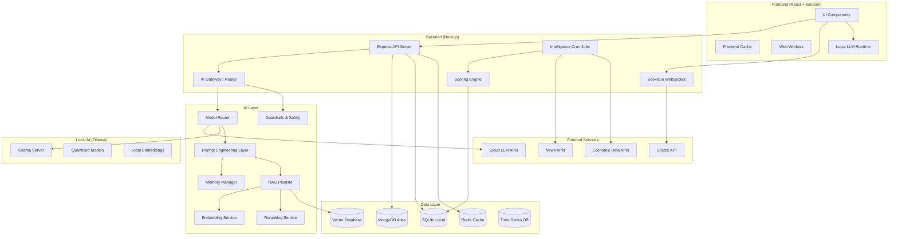

### 2.2 Request Flow Architecture

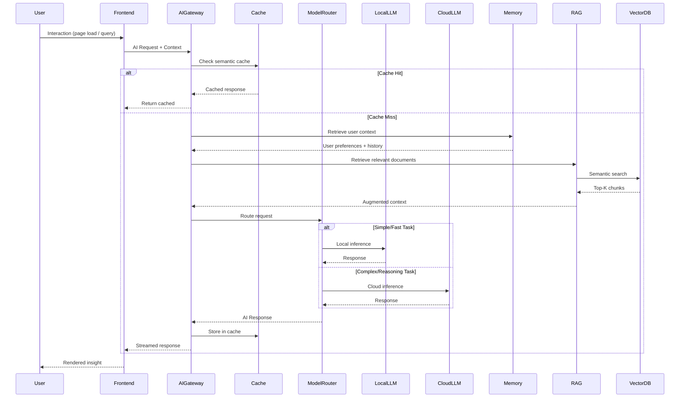

### 2.3 Data Flow Architecture

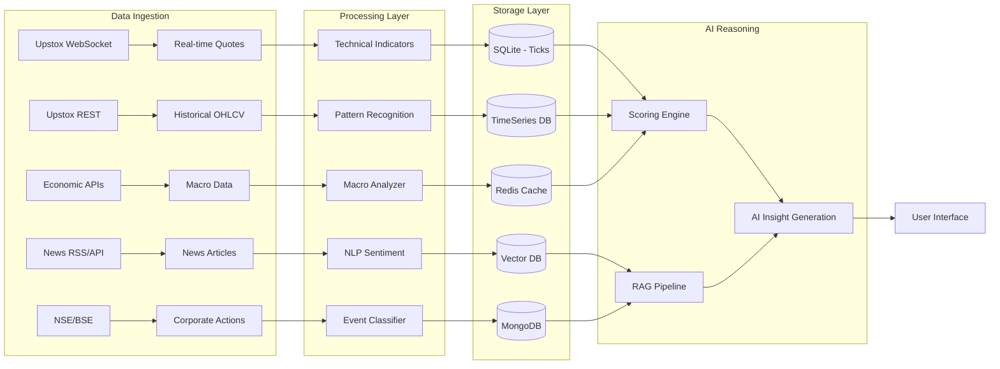

---

## 3. AI Architecture Layers

### 3.1 Layer Overview

The Praxis AI system is composed of **10 distinct layers**, each with specific responsibilities:

| Layer | Responsibility | Technology |
|:---|:---|:---|
| **AI Gateway** | Single entry point for all AI requests | Custom Node.js service |
| **Model Router** | Route requests to optimal model based on task | LiteLLM / Custom |
| **Inference Layer** | Execute model inference (local or cloud) | Ollama / Cloud APIs |
| **Prompt Layer** | Construct, template, and manage prompts | Handlebars / Custom |
| **Memory Layer** | Manage short-term, long-term, and semantic memory | Mem0 / Custom |
| **RAG Layer** | Retrieve and augment context from knowledge base | LlamaIndex / Custom |
| **Embedding Layer** | Generate vector representations of text/data | Ollama / API |
| **Reranking Layer** | Rerank retrieved documents for relevance | Cross-encoder / API |
| **Caching Layer** | Semantic and exact-match caching | Redis + Custom |
| **Monitoring Layer** | Track latency, cost, quality, and errors | Langfuse / Custom |

### 3.2 AI Gateway Architecture

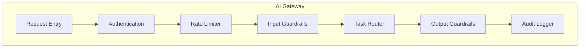

**Recommended:** Custom Node.js AI Gateway service
- **Why:** Full control over routing logic, caching, and Indian market-specific guardrails
- **Alternative:** Portkey AI Gateway (managed SaaS)
  - **Tradeoffs:** Portkey offers zero-ops but adds latency hop and external dependency; Custom gives full data sovereignty

### 3.3 Model Router Decision Matrix

| Task Type | Complexity | Latency Req | Model Target | Reason |
|:---|:---|:---|:---|:---|
| Indicator insight (single) | Low | <500ms | Local 8B | Fast, cached, privacy |
| Fundamental analysis | Medium | <3s | Local 14B or Cloud Flash | Balance of quality and speed |
| Multi-stock comparison | High | <10s | Cloud Pro | Requires large context |
| Event impact analysis | High | <5s | Cloud Pro | Complex reasoning needed |
| Chart pattern description | Medium | <2s | Local 14B | Visual not needed for text desc |
| Chart QA (with image) | High | <5s | Cloud Vision | Requires multimodal |
| Portfolio optimization | High | <15s | Cloud Pro | Complex math reasoning |
| News sentiment batch | Medium | <30s (batch) | Local 8B (batch) | High volume, low complexity |
| Chat conversation | Variable | <3s | Cloud Sonnet/Flash | Best conversational quality |
| Embedding generation | Low | <100ms | Local nomic-embed | High volume, must be fast |

### 3.4 Confidence Score Architecture

Every AI output in Praxis MUST include a confidence score. The confidence is computed as a **composite of multiple signals**:

```
Confidence = w1 × DataCompleteness + w2 × ModelCertainty + w3 × HistoricalAccuracy + w4 × ConsensusAlignment

Where:
  DataCompleteness (0-1): Fraction of required data fields that are present and valid
  ModelCertainty (0-1): Derived from logprobs / softmax temperature of model output
  HistoricalAccuracy (0-1): Rolling accuracy of similar past predictions
  ConsensusAlignment (0-1): Agreement between multiple analytical methods
  
  Default weights: w1=0.30, w2=0.25, w3=0.25, w4=0.20
```

| Confidence Level | Score Range | UI Treatment |
|:---|:---|:---|
| Very High | 85-100% | Green badge, full recommendation |
| High | 70-84% | Blue badge, standard display |
| Medium | 50-69% | Yellow badge, with caveats |
| Low | 30-49% | Orange badge, "Insufficient data" warning |
| Very Low | 0-29% | Red badge, "Not reliable" disclaimer |

---

## 4. Module Specifications

### 4.1 Dashboard

#### Purpose
The command center of Praxis. Provides a 360° view of the user's financial universe — portfolio health, watchlist movements, market regime, top movers, and AI-generated daily briefing.

#### User Workflow
1. User opens Praxis → Dashboard loads
2. Market overview tiles populate with live data
3. AI generates a "Morning Briefing" summarizing overnight global events
4. Portfolio heatmap shows real-time P&L
5. Watchlist cards show AI scores and signals
6. Event ticker shows upcoming catalysts

#### Inputs
| Input | Source | Update Frequency |
|:---|:---|:---|
| Portfolio holdings | MongoDB / Broker API | On login + WebSocket |
| Watchlist instruments | MongoDB | On login |
| Market indices (Nifty, BankNifty, Sensex) | Upstox WebSocket | Real-time |
| FII/DII flow data | NSE / Cron | Every 30 min |
| Sector performance | Upstox / Calculated | Every 5 min |
| News headlines | News API / Cron | Every 15 min |
| Global market indices | Alpha Vantage / Cron | Every 30 min |

#### Outputs
| Output | AI Involvement | Format |
|:---|:---|:---|
| Morning Briefing | ✅ Full AI generation | 3-5 sentence summary |
| Market Regime Label | ✅ AI classification | Bullish/Bearish/Neutral/Volatile |
| Portfolio Health Score | ✅ AI composite scoring | 0-100 score + explanation |
| Top Movers Analysis | ✅ AI explanation for moves | Per-stock reasoning |
| Risk Alert Banner | ✅ AI risk detection | Priority-ordered alerts |
| Sector Rotation Map | Partial (deterministic + AI insight) | Heatmap + AI narrative |

#### AI Requirements

| Requirement | Specification |
|:---|:---|
| **Model** | Local 8B for individual insights; Cloud Flash for morning briefing |
| **Inference Location** | Backend (cron for briefing), Frontend cache for scores |
| **Caching** | Morning briefing: 4-hour TTL; Scores: 15-min TTL |
| **Response Reuse** | Yes — all users get same market regime; portfolio insights are per-user |
| **Confidence Scores** | Yes — per insight tile |
| **Reasoning** | Yes — every score shows expandable "Why" section |
| **RAG** | Yes — for morning briefing (pulls from news + events knowledge base) |
| **Memory** | Yes — remembers user's preferred dashboard layout and notification preferences |
| **Embeddings** | Yes — news articles are embedded for semantic retrieval |
| **Vector Search** | Yes — for relevant news retrieval |
| **Latency** | Dashboard load: <2s; Individual tiles: <500ms; Briefing: <5s |
| **Streaming** | Yes — for morning briefing generation |

#### Storage Requirements
| Data | Storage | Size Estimate |
|:---|:---|:---|
| Dashboard preferences | MongoDB (User doc) | <1 KB/user |
| Cached AI insights | Redis | ~5 KB/instrument |
| Morning briefing | SQLite | ~2 KB/day |
| Historical briefings | SQLite → DuckDB | ~730 KB/year |

#### Possible Future Features
- Voice-narrated morning briefing (TTS)
- Personalized AI avatar presenting market summary
- Predictive portfolio alerts ("Based on events, expect ₹X impact")
- Social sentiment integration

---

### 4.2 Fundamentals

#### Purpose
Deep fundamental analysis of any NSE/BSE listed company. Provides institutional-grade financial statement analysis, valuation metrics, peer comparison, and AI-generated investment thesis.

#### User Workflow
1. User selects a stock from search/watchlist
2. Fundamental page loads with indicator cards organized by section
3. Each card shows: metric value, historical trend, score (0-100), and AI insight
4. Global header shows composite fundamental score and regime classification
5. User can flip cards to see calculation methodology
6. AI generates section-level and stock-level insights

#### Inputs
| Input | Source | Update Frequency |
|:---|:---|:---|
| Financial statements (Income, Balance Sheet, Cash Flow) | Upstox Fundamentals API | 2x daily (cron) |
| Key ratios (PE, PB, ROE, etc.) | Upstox Fundamentals API | 2x daily |
| Shareholding patterns | Upstox API | Quarterly |
| Live quote (LTP, market cap) | Upstox WebSocket | Real-time |
| Manual overrides (Forward PE, etc.) | User input via GlobalHeader | On input |
| Sector averages | Computed from peer data | Daily |
| Historical snapshots | SQLite AI Card Store | Per cron cycle |

#### Outputs
| Output | AI Involvement | Format |
|:---|:---|:---|
| 30+ Indicator Cards | ✅ AI insight per card | Score + trend + explanation |
| Composite Score (0-100) | Deterministic engine + AI regime label | Number + Bullish/Bearish/Neutral |
| Section Scores (Valuation, Growth, Profitability, etc.) | Deterministic | Per-section 0-100 |
| Tailwinds & Risks | ✅ AI generated from data relationships | Bullet list |
| AI Insight (stock-level) | ✅ Full AI generation | 2-4 sentence narrative |
| Regime Shift Alert | Deterministic (score delta >15) | Alert banner |
| Intrinsic Value Estimate | ✅ DCF + AI interpretation | ₹ value + confidence |

#### AI Requirements

| Requirement | Specification |
|:---|:---|
| **Model** | Local 14B for per-card insights; Cloud Flash for stock-level narrative |
| **Inference Location** | Backend (cron) for batch processing; Frontend for interactive queries |
| **Caching** | Per-instrument, per-card, 12-hour TTL (aligned with cron cycles) |
| **Response Reuse** | Yes — same stock fundamentals are shared across users |
| **Confidence Scores** | Yes — driven by data completeness and data age |
| **Reasoning** | Yes — every card has `aiInsight` field explaining the score |
| **RAG** | Optional — for pulling comparable company data or sector benchmarks |
| **Memory** | Yes — remembers user's preferred valuation methodology |
| **Embeddings** | Not primary — structured data dominates |
| **Vector Search** | No — direct SQLite queries suffice |
| **Latency** | Card rendering: <200ms (cached); Full AI refresh: <30s (cron, async) |
| **Streaming** | No — pre-computed and stored |

#### AI Insight Generation Pattern (Current Implementation)

The existing scoring engine (`engine/scoringEngine.js`) computes deterministic scores. AI insights are generated by the `generateAiInsight*()` functions which use **template-driven logic** (not LLM calls). The future architecture should:

1. **Keep** deterministic math in `scoringEngine.js` (unchanged)
2. **Add** LLM-generated insights as a second layer for:
   - Cross-indicator relationship analysis ("PE is low but ROE is declining — value trap risk")
   - Peer comparison narratives
   - Intrinsic value confidence assessment
   - Earnings quality analysis

#### Fundamental Indicators AI Coverage

| Category | Indicators | AI Role |
|:---|:---|:---|
| **Valuation** | PE, PB, PS, EV/EBITDA, PEG, Forward PE, Dividend Yield | Score + compare to sector + historical |
| **Growth** | Revenue Growth, EPS Growth, PAT Growth, Book Value Growth | Trend analysis + sustainability assessment |
| **Profitability** | ROE, ROCE, ROA, Operating Margin, Net Margin, EBITDA Margin | Margin trajectory + peer ranking |
| **Leverage** | Debt/Equity, Interest Coverage, Current Ratio, Quick Ratio | Risk scoring + distress probability |
| **Cash Flow** | FCF, CFO/PAT, Capex/Revenue, Cash Conversion | Quality of earnings assessment |
| **Shareholding** | Promoter %, FII %, DII %, Pledge % | Smart money tracking + pledge risk |
| **Earnings Quality** | Accrual Ratio, CFO vs PAT, Working Capital Cycle | Manipulation detection |

#### Storage Requirements
| Data | Storage | Size Estimate |
|:---|:---|:---|
| Raw fundamental data | SQLite (local cache) | ~50 KB/instrument |
| Computed scores & insights | SQLite AI Card Store | ~10 KB/instrument/snapshot |
| Historical score snapshots | SQLite → DuckDB (archival) | ~3.6 MB/instrument/year |
| Manual overrides | MongoDB (per user) | <1 KB/instrument/user |

#### Possible Future Features
- DCF model with AI-suggested assumptions
- Quarterly earnings surprise tracker
- Management quality scoring using NLP on conference calls
- Comparable company auto-selection
- AI-generated equity research reports (PDF export)

---

### 4.3 Technical Analysis

#### Purpose
Real-time technical analysis with 167+ indicators, AI-powered pattern recognition, signal generation, and multi-timeframe confluence analysis. The system should function at an institutional level, providing actionable intelligence rather than raw indicator values.

#### User Workflow
1. User selects a stock and timeframe
2. Chart loads with price data and selected overlays
3. Indicator cards show values, scores, and AI insights (same card pattern as Fundamentals)
4. AI generates multi-timeframe confluence report
5. Pattern recognition overlay shows detected patterns
6. Signal panel shows buy/sell/hold with confidence

#### Inputs
| Input | Source | Update Frequency |
|:---|:---|:---|
| OHLCV data (1m, 5m, 15m, 1h, 1D, 1W) | Upstox Historical API + WebSocket | Real-time for intraday |
| Calculated indicators | `technicalCalculationService.js` | Per candle close |
| Chart patterns | AI pattern recognition model | Per timeframe update |
| Volume profile | Computed from tick data | Every 5 min |
| Order flow (if available) | Upstox / NSE | Real-time |

#### Outputs
| Output | AI Involvement | Format |
|:---|:---|:---|
| 167+ Indicator Cards | ✅ AI insight per indicator | Value + Score + Signal + Explanation |
| Composite Technical Score | Deterministic weighted | 0-100 |
| Pattern Detection | ✅ CNN/Vision model | Pattern name + confidence + target |
| Signal Generation | ✅ AI multi-indicator fusion | Buy/Sell/Hold + confidence |
| Multi-Timeframe Confluence | ✅ AI narrative | Agreement matrix + explanation |
| Anomaly Detection | ✅ Statistical + AI | Volume/price anomaly alerts |
| Support/Resistance Levels | Deterministic + AI refinement | Price levels + strength |

#### AI Requirements

| Requirement | Specification |
|:---|:---|
| **Model** | Local 8B for per-indicator insights; Local 14B for signal generation; Cloud Vision for pattern recognition |
| **Inference Location** | Backend for cron-computed indicators; Frontend for interactive chart analysis |
| **Caching** | Per-instrument, per-timeframe, 1-candle TTL |
| **Response Reuse** | Yes — indicator scores are universal; signals may be personalized by risk profile |
| **Confidence Scores** | Yes — per signal, per pattern |
| **Reasoning** | Yes — every signal explains which indicators agree/disagree |
| **RAG** | No — primarily real-time data driven |
| **Memory** | Yes — remembers user's preferred indicators and timeframes |
| **Embeddings** | No — numerical data, not text |
| **Vector Search** | No |
| **Latency** | Indicator update: <100ms; Signal generation: <1s; Pattern detection: <3s |
| **Streaming** | Optional — for multi-timeframe narrative |

#### Technical Indicator Categories

| Category | Count | Indicators | AI Application |
|:---|:---|:---|:---|
| **Trend** | 25+ | EMA (9/20/50/100/200), SMA, Supertrend, ADX, Parabolic SAR, Ichimoku | Trend strength quantification, trend change detection |
| **Momentum** | 30+ | RSI, MACD, Stochastic, CCI, Williams %R, MFI, ROC, Momentum | Overbought/oversold with context (is this a trend or reversal?) |
| **Volatility** | 15+ | Bollinger Bands, ATR, Keltner Channels, Donchian, Standard Deviation | Volatility regime detection, breakout probability |
| **Volume** | 20+ | OBV, VWAP, Volume Profile, CMF, A/D Line, Volume Oscillator | Smart money detection, accumulation/distribution |
| **Oscillators** | 25+ | Ultimate Oscillator, Aroon, KDJ, TRIX, DPO, PPO | Divergence detection, mean reversion signals |
| **Custom/Composite** | 15+ | Squeeze Momentum, Elder Ray, Market Breadth | Multi-indicator fusion signals |
| **Pattern Recognition** | 35+ | Head & Shoulders, Double Top/Bottom, Triangles, Flags, Wedges, Harmonics | CNN-based visual recognition + rule-based confirmation |

#### Signal Generation Architecture

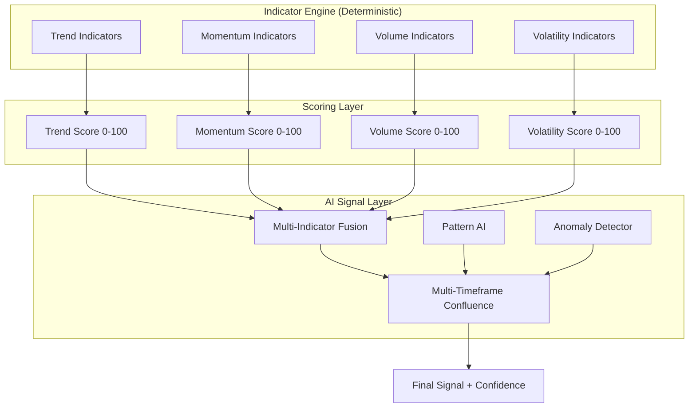

#### Indicator Weighting System

**Recommended:** Dynamic weighting based on market regime

| Market Regime | Trend Weight | Momentum Weight | Volume Weight | Volatility Weight |
|:---|:---|:---|:---|:---|
| Strong Trend | 0.40 | 0.25 | 0.20 | 0.15 |
| Range-Bound | 0.15 | 0.40 | 0.25 | 0.20 |
| High Volatility | 0.20 | 0.20 | 0.25 | 0.35 |
| Low Volatility | 0.30 | 0.30 | 0.25 | 0.15 |

**Alternative:** Fixed equal weighting (0.25 each)
- **Why Dynamic:** Market regime determines which indicator categories are most reliable
- **Tradeoffs:** Dynamic requires regime detection accuracy; fixed is simpler but less accurate

#### Storage Requirements
| Data | Storage | Size Estimate |
|:---|:---|:---|
| OHLCV candles (all timeframes) | SQLite / DuckDB | ~500 KB/instrument/year (daily) |
| Computed indicators | SQLite (hot) + DuckDB (archive) | ~200 KB/instrument/snapshot |
| Pattern detection results | SQLite | ~5 KB/instrument/scan |
| AI signals & insights | SQLite AI Card Store | ~10 KB/instrument/snapshot |

#### Possible Future Features
- Real-time pattern recognition using edge-deployed CNN
- Order flow analysis with AI institutional activity detection
- Automated backtesting of AI-generated signals
- Inter-market technical analysis (correlation with global indices)
- Harmonic pattern auto-detection with precision targets

---

### 4.4 Options Analysis

#### Purpose
Advanced derivatives analytics for NSE F&O with focus on Open Interest analysis, Greeks, dealer positioning, gamma exposure, max pain, and AI-driven sentiment classification.

#### User Workflow
1. User selects an F&O instrument (Nifty, BankNifty, or stock)
2. Options chain loads with real-time data
3. OI analysis cards show changes, PCR, and AI interpretation
4. Greeks panel shows risk metrics with AI explanations
5. GEX (Gamma Exposure) chart shows dealer positioning zones
6. AI generates expiry outlook and strategy suggestions

#### Inputs
| Input | Source | Update Frequency |
|:---|:---|:---|
| Options chain (all strikes) | Upstox Options Chain API | Every 1-3 min |
| Greeks (Delta, Gamma, Theta, Vega, Rho) | Calculated / Upstox | Every 1-3 min |
| Underlying price | Upstox WebSocket | Real-time |
| Implied Volatility (IV) | Calculated from chain | Every 1-3 min |
| Historical OI data | SQLite local storage | End of day |
| FII/DII F&O data | NSE | End of day |

#### Outputs
| Output | AI Involvement | Format |
|:---|:---|:---|
| OI Analysis Cards | ✅ AI interpretation | OI change + long/short buildup |
| PCR Trend | ✅ AI sentiment mapping | Ratio + trend direction + AI insight |
| IV Rank / Percentile | Deterministic + AI context | Number + percentile + explanation |
| Greeks Dashboard | ✅ AI risk explanation | Per-position Greeks + aggregate |
| GEX Profile | ✅ AI dealer positioning narrative | Chart + key levels + regime |
| Max Pain Analysis | Deterministic + AI | Price level + probability |
| OI Shift Detection | ✅ AI anomaly flagging | Alert when significant shifts occur |
| Strategy Suggestions | ✅ Full AI generation | Strategy name + legs + risk/reward |
| Expiry Outlook | ✅ AI narrative | Bullish/Bearish/Neutral + reasoning |

#### AI Requirements

| Requirement | Specification |
|:---|:---|
| **Model** | Local 14B for OI interpretation; Cloud Flash for strategy suggestions |
| **Inference Location** | Backend for batch OI analysis; Frontend for interactive |
| **Caching** | Short TTL (3-5 min) due to fast-moving data |
| **Response Reuse** | Yes — OI analysis is shared across users for same instrument |
| **Confidence Scores** | Yes — driven by OI volume significance and IV stability |
| **Reasoning** | Yes — every OI shift explains bullish vs bearish interpretation |
| **RAG** | Optional — for pulling historical expiry patterns |
| **Memory** | Yes — remembers user's preferred strategies and risk tolerance |
| **Embeddings** | No |
| **Vector Search** | No |
| **Latency** | OI cards: <500ms; GEX chart: <2s; Strategy suggestion: <5s |
| **Streaming** | Yes — for strategy explanations |

#### Options AI Analysis Pipeline

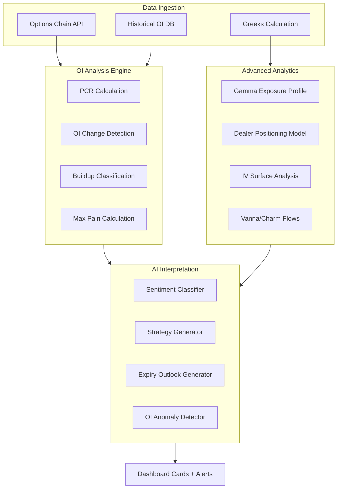

#### Dealer Positioning Analysis

| Metric | Calculation | AI Interpretation |
|:---|:---|:---|
| **Positive GEX** | Sum of dealer gamma > 0 | "Market makers are long gamma — expect dampened volatility, mean reversion" |
| **Negative GEX** | Sum of dealer gamma < 0 | "Market makers are short gamma — expect amplified moves, trending behavior" |
| **Gamma Flip Level** | Strike where GEX crosses zero | "Critical regime boundary at ₹X — above = stability, below = volatility" |
| **Call Wall** | Strike with highest call OI | "Resistance expected at ₹X due to dealer hedging pressure" |
| **Put Wall** | Strike with highest put OI | "Support expected at ₹X due to dealer hedging pressure" |
| **Vanna Exposure** | Sensitivity to IV changes | "If IV drops, expect dealer-driven upward pressure" |

#### Storage Requirements
| Data | Storage | Size Estimate |
|:---|:---|:---|
| Options chain snapshots | SQLite | ~100 KB/instrument/snapshot |
| Historical OI data | DuckDB | ~5 MB/instrument/year |
| Greeks snapshots | SQLite | ~50 KB/instrument/snapshot |
| GEX profiles | Redis (hot cache) | ~20 KB/instrument |
| AI insights | SQLite AI Card Store | ~5 KB/instrument/snapshot |

#### Possible Future Features
- Real-time options flow scanner (block trades, sweeps)
- AI-powered volatility surface modeling
- Automatic spread strategy recommendation engine
- Expiry day "Game Plan" generator
- Multi-expiry rollover analysis

---

### 4.5 Events

#### Purpose
Comprehensive event intelligence system that captures, classifies, scores, and predicts the market impact of every relevant event affecting the Indian stock market — from RBI policy decisions to global conflicts.

#### User Workflow
1. User navigates to Events page
2. Timeline view shows upcoming and recent events
3. Each event card shows category, sentiment, severity, and affected instruments
4. AI generates market impact assessment for each event
5. User can filter by category, sector, stock, or time horizon
6. Alert system notifies user of high-impact events

#### Inputs
| Input | Source | Update Frequency |
|:---|:---|:---|
| Economic news | NewsAPI, Google News RSS, MoneyControl | Every 15 min |
| Corporate announcements | BSE/NSE filings, Upstox | Real-time (during market) |
| Government decisions | Government press releases, news scraping | Every 30 min |
| Budget announcements | Live during budget; news APIs post | Event-driven |
| RBI policy decisions | RBI website, news APIs | Event-driven |
| Federal Reserve decisions | FRED API, financial news | Event-driven |
| Earnings calendar | NSE, MoneyControl scraping | Daily |
| IPO calendar | NSE, SEBI filings | Daily |
| Global conflicts | News APIs, geopolitical feeds | Every 30 min |
| Weather events | OpenWeatherMap API | Every 2 hours |
| Commodity prices | Alpha Vantage, commodity APIs | Every 15 min |
| Political events | News APIs | Every 30 min |

#### Event Classification Schema

Every event MUST receive the following AI-generated fields:

| Field | Type | Possible Values |
|:---|:---|:---|
| **Category** | Enum | `ECONOMIC`, `CORPORATE`, `GOVERNMENT`, `MONETARY_POLICY`, `GLOBAL`, `GEOPOLITICAL`, `EARNINGS`, `IPO`, `COMMODITY`, `WEATHER`, `POLITICAL`, `REGULATORY` |
| **Sentiment** | Enum + Score | `BULLISH` (+0.5 to +1.0), `MILDLY_BULLISH` (+0.1 to +0.5), `NEUTRAL` (-0.1 to +0.1), `MILDLY_BEARISH` (-0.5 to -0.1), `BEARISH` (-1.0 to -0.5) |
| **Severity** | Enum + Score | `CRITICAL` (9-10), `HIGH` (7-8), `MEDIUM` (5-6), `LOW` (3-4), `NEGLIGIBLE` (1-2) |
| **Confidence** | Float | 0.0 to 1.0 |
| **Market Impact** | Structured | `{ direction, magnitude, probability, duration }` |
| **Affected Sectors** | Array | `["Banking", "IT", "Pharma", ...]` |
| **Affected Indices** | Array | `["NIFTY50", "BANKNIFTY", "NIFTYIT", ...]` |
| **Affected Stocks** | Array | `[{ symbol, instrumentKey, impactDirection, impactMagnitude }]` |
| **Time Horizon** | Enum | `IMMEDIATE` (<1 day), `SHORT_TERM` (1-7 days), `MEDIUM_TERM` (1-4 weeks), `LONG_TERM` (1-12 months) |
| **Risk Score** | Float | 0.0 to 10.0 |
| **AI Explanation** | String | 2-5 sentence narrative explaining the assessment |

#### Event Processing Pipeline

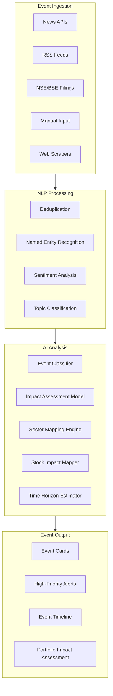

#### AI Requirements

| Requirement | Specification |
|:---|:---|
| **Model** | Cloud Flash for classification; Cloud Pro for impact assessment of critical events |
| **Inference Location** | Backend cron for batch; Backend real-time for critical events |
| **Caching** | Per-event, long TTL (events don't change once classified) |
| **Response Reuse** | Yes — events are universal, not per-user |
| **Confidence Scores** | Yes — critical for market impact predictions |
| **Reasoning** | Yes — every event must explain WHY it affects specific sectors/stocks |
| **RAG** | Yes — pull historical precedents ("Last time RBI raised rates by 25bps, Nifty fell X%") |
| **Memory** | No — events are stateless |
| **Embeddings** | Yes — event text is embedded for deduplication and similarity search |
| **Vector Search** | Yes — find similar historical events |
| **Latency** | Classification: <3s; Full impact assessment: <10s |
| **Streaming** | Yes — for AI explanation generation |

#### Required AI Models for Events

| Task | Recommended Model | Alternative | Why |
|:---|:---|:---|:---|
| **News Classification** | Local Qwen3-8B | Cloud Gemini Flash-Lite | High volume, simple task; local avoids API costs |
| **Sentiment Analysis** | Local Qwen3-8B | FinBERT (specialized) | General LLM performs comparably; FinBERT is more efficient for pure sentiment |
| **NER (Entity Extraction)** | spaCy + Custom model | Cloud LLM | spaCy is deterministic and fast for entity extraction |
| **Impact Assessment** | Cloud Gemini 2.5 Flash | Cloud Claude Sonnet | Requires reasoning over multiple data sources |
| **Historical Precedent Lookup** | RAG + Cloud Flash | RAG + Local 14B | Needs large context for historical comparison |
| **Sector/Stock Mapping** | Deterministic lookup table + AI fallback | Pure AI | Deterministic is faster and more reliable for known mappings |

#### Event-to-Sector Mapping (Deterministic Base)

| Event Category | Primary Sectors | Secondary Sectors |
|:---|:---|:---|
| RBI Rate Decision | Banking, NBFC, Real Estate | Auto, Consumer Durables |
| Budget Announcements | Infrastructure, Defense | All sectors (depends on specific announcements) |
| Crude Oil Shock | Oil & Gas, Airlines, Paint, Tires | Consumer, Auto |
| IT Earnings | IT Services | Depends on guidance |
| Monsoon Update | FMCG, Agriculture, Fertilizer | Insurance, Banking (rural) |
| Global Risk-Off | All (esp. FII-heavy) | IT (reverse impact possible) |
| Rupee Depreciation | IT (positive), Pharma (positive) | Oil Importers (negative), FMCG (negative) |

#### Storage Requirements
| Data | Storage | Size Estimate |
|:---|:---|:---|
| Raw event data | MongoDB | ~2 KB/event |
| Event embeddings | Vector DB (Qdrant) | ~3 KB/event |
| Classified events | MongoDB + SQLite mirror | ~5 KB/event |
| Historical event archive | DuckDB | ~50 MB/year |
| Event-stock impact history | DuckDB | ~20 MB/year |

#### Possible Future Features
- Predictive event modeling ("Based on economic indicators, probability of rate hike is X%")
- Event chain analysis (how one event triggers cascading events)
- Geopolitical risk scoring with map visualization
- Automated hedge suggestions based on event exposure
- Conference call NLP analysis for earnings events

---

### 4.6 Macro Economics

#### Purpose
Track and analyze macroeconomic indicators for India and globally. Provide AI-generated analysis of how macro conditions affect market sectors and individual stocks.

#### User Workflow
1. User navigates to Macro page
2. Dashboard shows key macro indicators (GDP, CPI, IIP, PMI, etc.)
3. Each indicator card shows current value, trend, and AI analysis
4. Correlation matrix shows indicator-to-sector relationships
5. AI generates macro outlook narrative

#### Inputs
| Input | Source | Update Frequency |
|:---|:---|:---|
| India GDP | MOSPI / RBI data | Quarterly |
| CPI Inflation | MOSPI | Monthly |
| IIP (Industrial Production) | MOSPI | Monthly |
| PMI Manufacturing/Services | IHS Markit | Monthly |
| Repo Rate | RBI | Per policy meeting |
| Forex Reserves | RBI | Weekly |
| Trade Balance | DGFT | Monthly |
| FII/DII Flows | NSE/NSDL | Daily |
| US macro (Fed Rate, CPI, NFP) | FRED API | Per release |
| Global PMIs | Trading Economics | Monthly |
| Commodity Prices (Crude, Gold) | Alpha Vantage / Free APIs | Daily |
| INR/USD Exchange Rate | Upstox / Forex API | Real-time |

#### Outputs
| Output | AI Involvement | Format |
|:---|:---|:---|
| Macro Dashboard Cards | ✅ AI trend analysis per indicator | Card + chart + narrative |
| Macro-to-Sector Impact Matrix | ✅ AI correlation analysis | Heatmap + explanation |
| Economic Cycle Phase | ✅ AI classification | Expansion/Peak/Contraction/Trough |
| Interest Rate Outlook | ✅ AI probability assessment | Probability table + narrative |
| Currency Impact Analysis | ✅ AI sector impact | INR scenarios + sector winners/losers |

#### AI Requirements

| Requirement | Specification |
|:---|:---|
| **Model** | Cloud Flash for indicator analysis; Cloud Pro for cycle assessment |
| **Inference Location** | Backend (cron, monthly/weekly cycle) |
| **Caching** | Long TTL (matches data release frequency — daily/weekly/monthly) |
| **Response Reuse** | Yes — macro is universal |
| **Confidence Scores** | Yes — driven by data recency and historical model accuracy |
| **Reasoning** | Yes — every macro assessment explains historical context |
| **RAG** | Yes — pull historical macro data for trend context |
| **Memory** | No — macro analysis is stateless |
| **Embeddings** | Yes — macro reports are embedded for RAG |
| **Vector Search** | Yes — for historical precedent lookup |
| **Latency** | Dashboard load: <2s (cached); Full macro refresh: <30s (cron) |
| **Streaming** | No — pre-computed |

#### Storage Requirements
| Data | Storage | Size Estimate |
|:---|:---|:---|
| Macro indicator time series | DuckDB | ~10 MB/year |
| AI macro assessments | SQLite | ~5 KB/assessment |
| Correlation matrices | Redis (cached) | ~50 KB |

#### Possible Future Features
- Leading indicator prediction model
- Yield curve analysis and inversion detection
- Capital flow prediction (FII/DII)
- Real-time GDP nowcasting

---

### 4.7 Global Markets

#### Purpose
Track global indices, currencies, commodities, and crypto with AI-powered correlation analysis to Indian markets.

#### Inputs
Global indices (S&P 500, NASDAQ, Nikkei, DAX, FTSE, Shanghai), Crypto (BTC, ETH), Commodities (Crude, Gold, Silver, Copper), Major currencies (DXY, EUR, GBP, JPY, CNY vs USD)

#### AI Requirements

| Requirement | Specification |
|:---|:---|
| **Model** | Cloud Flash for correlation analysis |
| **Inference Location** | Backend cron |
| **Caching** | 30-min TTL for market hours; 4-hour for off-hours |
| **Latency** | <2s for dashboard; <10s for full correlation analysis |
| **Streaming** | No |

#### Possible Future Features
- Inter-market divergence alerts
- Global risk-on/risk-off regime classifier
- Currency carry trade impact on Indian markets

---

### 4.8 Trading Journal

#### Purpose
Personal trading journal with AI-powered post-trade analysis, pattern detection in trading behavior, and performance analytics.

#### User Workflow
1. User logs a trade (entry, exit, size, rationale, emotions)
2. AI auto-classifies the trade (scalp, swing, positional)
3. AI analyzes the trade against the market context at the time
4. Over time, AI identifies behavioral patterns (e.g., "You tend to exit winners too early")
5. Monthly/weekly AI-generated performance reports

#### Inputs
| Input | Source | Update Frequency |
|:---|:---|:---|
| Trade entries | User input | On trade logging |
| Market data at trade time | SQLite historical | On trade logging |
| User's technical setup at trade time | Calculated indicators | On trade logging |
| Emotional state tags | User input | On trade logging |
| P&L calculations | Computed | On trade logging |

#### Outputs
| Output | AI Involvement | Format |
|:---|:---|:---|
| Trade Classification | ✅ AI auto-classification | Scalp/Swing/Positional + tag |
| Post-Trade Analysis | ✅ Full AI generation | "What went right/wrong" narrative |
| Behavioral Pattern Detection | ✅ AI long-term analysis | Pattern name + evidence + suggestion |
| Performance Analytics | Deterministic + AI narrative | Charts + AI summary |
| Weekly/Monthly Report | ✅ Full AI generation | PDF/MD report |
| Streak Detection | ✅ AI pattern analysis | Win/loss streaks + emotional correlation |

#### AI Requirements

| Requirement | Specification |
|:---|:---|
| **Model** | Cloud Flash for trade analysis; Local 14B for behavioral patterns |
| **Inference Location** | Backend for batch analysis; Frontend for interactive review |
| **Caching** | Per-trade analysis is cached permanently (trades don't change) |
| **Response Reuse** | No — journal is deeply personal |
| **Confidence Scores** | Yes — for behavioral pattern confidence |
| **Reasoning** | Yes — every pattern must cite specific trades as evidence |
| **RAG** | Yes — retrieve past journal entries for pattern analysis |
| **Memory** | Yes — long-term memory of user's trading personality |
| **Embeddings** | Yes — trade rationales are embedded for semantic search |
| **Vector Search** | Yes — "Find trades similar to this one" |
| **Latency** | Trade logging: <1s; Analysis: <5s; Report: <30s |
| **Streaming** | Yes — for narrative generation |

#### Storage Requirements
| Data | Storage | Size Estimate |
|:---|:---|:---|
| Trade entries | MongoDB (per user) | ~2 KB/trade |
| Trade embeddings | Vector DB (per user) | ~1 KB/trade |
| AI analyses | MongoDB | ~3 KB/trade |
| Behavioral patterns | MongoDB | ~5 KB/user |
| Performance reports | MongoDB + file storage | ~50 KB/report |

---

### 4.9 Watchlist

#### Purpose
Curated lists of stocks with real-time price updates, composite scores, and AI-generated watchlist intelligence.

#### AI Requirements

| Requirement | Specification |
|:---|:---|
| **Model** | Local 8B for per-stock insights; Cloud Flash for watchlist-level analysis |
| **Inference Location** | Backend cron for batch scoring; Frontend for interactive |
| **Caching** | 15-min TTL for scores; real-time for prices |
| **Reasoning** | Yes — "Why is this stock in your watchlist interesting today?" |
| **Memory** | Yes — remembers why user added each stock |
| **Latency** | <500ms per stock card |

#### Outputs
- Real-time price + change
- Composite AI score (fundamental + technical + sentiment)
- AI "Today's Take" for each stock
- Cross-watchlist correlation alerts
- "Best Opportunity" ranking within watchlist

---

### 4.10 Portfolio

#### Purpose
Real-time portfolio tracking with AI-powered risk analysis, allocation suggestions, and performance attribution.

#### AI Requirements

| Requirement | Specification |
|:---|:---|
| **Model** | Cloud Pro for portfolio optimization; Local 14B for individual holding analysis |
| **Inference Location** | Backend for optimization; Frontend for interactive queries |
| **Caching** | 5-min TTL for portfolio metrics; real-time for P&L |
| **Reasoning** | Yes — every suggestion explains the rationale |
| **Memory** | Yes — tracks user's investment goals and risk tolerance |
| **RAG** | Yes — pull sector research and company fundamentals |
| **Latency** | Portfolio overview: <2s; Optimization: <15s |
| **Streaming** | Yes — for optimization explanations |

#### Outputs
- Real-time portfolio valuation and P&L
- Asset allocation analysis with AI suggestions
- Risk metrics (beta, Sharpe, max drawdown) with AI context
- Concentration risk alerts
- Sector/factor exposure analysis
- "What-if" scenario analysis
- AI-generated portfolio health report

---

### 4.11 AI Chat

#### Purpose
Full-featured conversational AI assistant that can answer questions about any aspect of the user's financial data, explain analysis, and provide research assistance. This is the most complex AI module.

#### User Workflow
1. User opens chat panel (available from any page)
2. Chat has full context of current page and selected instrument
3. User asks questions in natural language
4. AI responds with data-grounded answers, charts, and tables
5. Chat supports tool calling (fetch data, run calculations, search)
6. Conversation history is persisted and searchable

#### AI Requirements

| Requirement | Specification |
|:---|:---|
| **Model** | Cloud Pro (Claude Sonnet/Opus or Gemini Pro) for primary; Cloud Flash for simple queries |
| **Inference Location** | Backend (all chat inference goes through backend for logging) |
| **Caching** | Semantic cache with 1-hour TTL for factual queries |
| **Response Reuse** | Partial — factual answers can be reused; personalized queries cannot |
| **Confidence Scores** | Yes — for financial advice/predictions |
| **Reasoning** | Yes — chain-of-thought required for all complex answers |
| **RAG** | Yes — primary retrieval mechanism for knowledge grounding |
| **Memory** | Yes — all memory types (working, episodic, semantic, procedural) |
| **Embeddings** | Yes — conversation history + knowledge base |
| **Vector Search** | Yes — for context retrieval |
| **Latency** | First token: <1s; Full response: <10s |
| **Streaming** | Yes — mandatory for all chat responses |

#### Agent Architecture

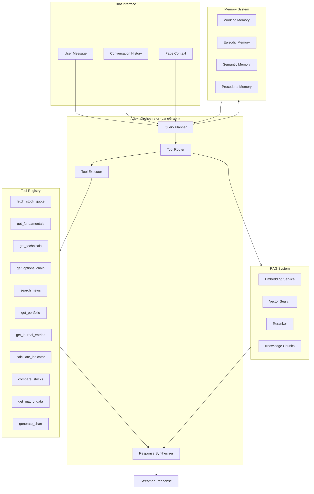

#### Tool Calling Specification

| Tool | Description | Parameters | Returns |
|:---|:---|:---|:---|
| `fetch_stock_quote` | Get real-time quote for a stock | `{ symbol: string }` | `{ ltp, change, volume, ... }` |
| `get_fundamentals` | Get fundamental data and scores | `{ instrumentKey: string }` | `{ scores, cards, regime }` |
| `get_technicals` | Get technical indicators | `{ instrumentKey: string, timeframe: string }` | `{ indicators, signal, score }` |
| `get_options_chain` | Get options chain data | `{ instrumentKey: string, expiry: string }` | `{ chain, pcr, maxPain }` |
| `search_news` | Semantic search through news | `{ query: string, limit: number }` | `{ articles[] }` |
| `get_portfolio` | Get user's portfolio | `{}` | `{ holdings, pnl, allocation }` |
| `get_journal_entries` | Search journal | `{ query: string }` | `{ entries[] }` |
| `calculate_indicator` | Compute a specific indicator | `{ instrumentKey, indicator, params }` | `{ value, signal }` |
| `compare_stocks` | Compare multiple stocks | `{ stocks: string[], metrics: string[] }` | `{ comparison_table }` |
| `get_macro_data` | Get macroeconomic data | `{ indicator: string }` | `{ timeseries, analysis }` |
| `generate_chart` | Render a chart | `{ type, data, options }` | `{ chartUrl }` |

#### Conversation Storage

| Data | Storage | Retention |
|:---|:---|:---|
| Active conversation | Redis (in-memory) | Session duration |
| Conversation history | MongoDB | 90 days (configurable) |
| Conversation embeddings | Vector DB | 90 days |
| Extracted facts/preferences | Semantic memory store | Permanent |

#### Chat Capabilities Matrix

| Capability | Model Required | Example Query |
|:---|:---|:---|
| **Stock Q&A** | Flash | "What's the PE ratio of Reliance?" |
| **Comparative Analysis** | Sonnet/Pro | "Compare HDFC Bank and ICICI Bank on all fundamentals" |
| **Technical Explanation** | Flash | "Explain what the MACD crossover means for TCS" |
| **Portfolio Review** | Pro | "Analyze my portfolio risk and suggest rebalancing" |
| **Journal Insights** | Sonnet | "What patterns do you see in my losing trades?" |
| **Event Impact** | Pro | "How will the RBI rate decision affect my portfolio?" |
| **Strategy Discussion** | Pro | "Design a covered call strategy for Nifty at current levels" |
| **Chart Understanding** | Vision (GPT-4o/Gemini) | "Analyze this chart screenshot" (with image) |
| **Multi-step Research** | Pro + Tools | "Find undervalued IT stocks with improving margins and buy signals" |

---

### 4.12 AI Drawing Tools

#### Purpose
AI-assisted technical drawing tools on charts. Includes automatic trendline detection, channel identification, Fibonacci placement, and support/resistance level identification.

#### AI Requirements

| Requirement | Specification |
|:---|:---|
| **Model** | Local CNN for pattern detection; Cloud Vision for chart QA |
| **Inference Location** | Frontend (WebGL/Canvas-based detection); Backend for complex patterns |
| **Caching** | Per-instrument, per-timeframe, invalidated on new candle |
| **Latency** | Auto-detection: <2s; Chart QA: <5s |
| **Streaming** | No — drawing results are discrete |

#### Features

| Feature | AI Method | Output |
|:---|:---|:---|
| **Auto Trendlines** | Linear regression on swing highs/lows | Line coordinates + slope + R² |
| **Channel Detection** | Parallel trendline algorithm | Upper/lower boundaries |
| **Fibonacci Retracement** | Auto swing point detection + Fib levels | Level lines (23.6%, 38.2%, 50%, 61.8%) |
| **Support/Resistance** | Cluster analysis on price action | Horizontal zones with strength |
| **Pattern Detection** | CNN on candlestick images | Pattern name + boundary + target |
| **Chart QA** | Vision LLM on screenshot | Natural language analysis |

#### Pattern Detection Architecture

**Recommended:** Hybrid approach
1. **Rule-based algorithms** for simple patterns (double top/bottom, head & shoulders)
2. **CNN model** (trained on labeled chart images) for complex/harmonic patterns
3. **Vision LLM** (Cloud) for chart understanding and QA

**Alternative:** Pure Vision LLM approach
- **Why Hybrid:** Rule-based is faster and more deterministic for known patterns; CNN handles visual patterns; Vision LLM handles open-ended questions
- **Tradeoffs:** Hybrid requires maintaining multiple systems; pure Vision LLM is simpler but slower and more expensive

---

### 4.13 Scanner

#### Purpose
AI-powered market scanner that finds stocks matching specific criteria across the entire NSE/BSE universe in real-time.

#### AI Requirements

| Requirement | Specification |
|:---|:---|
| **Model** | Local 8B for NL query parsing; Deterministic engine for scanning |
| **Inference Location** | Backend |
| **Caching** | Scanner results: 5-min TTL |
| **Latency** | Scan execution: <5s for ~500 stocks |

#### Features
- Natural language scan queries ("Find stocks breaking above 200 DMA with increasing volume")
- Pre-built institutional scans (Golden Cross, Insider Buying, Breakout, etc.)
- Custom scan builder with AI suggestions
- Real-time scan results with AI ranking

---

### 4.14 Screener

#### Purpose
Multi-factor stock screening with AI-powered factor analysis and scoring.

#### AI Requirements

| Requirement | Specification |
|:---|:---|
| **Model** | Local 8B for factor explanation; Deterministic engine for screening |
| **Inference Location** | Backend |
| **Caching** | Screener results: 15-min TTL (during market hours) |
| **Latency** | Screen execution: <10s for full universe |

#### Features
- Fundamental + Technical + Options multi-factor screening
- AI-generated factor importance analysis
- Custom factor creation with AI assistance
- Backtestable screening strategies
- Sector-relative screening

---

### 4.15 Alerts

#### Purpose
Intelligent alert system that goes beyond simple price alerts to include AI-powered condition monitoring.

#### AI Requirements

| Requirement | Specification |
|:---|:---|
| **Model** | Local 8B for alert context; Deterministic for condition evaluation |
| **Inference Location** | Backend (continuous evaluation) |
| **Latency** | Alert triggering: <30s from condition met |

#### Alert Types
| Type | AI Involvement | Example |
|:---|:---|:---|
| Price Alert | None (deterministic) | "RELIANCE crosses ₹2500" |
| Indicator Alert | None (deterministic) | "RSI(14) crosses above 70" |
| Pattern Alert | ✅ AI detection | "Double bottom detected on HDFC" |
| News Alert | ✅ AI classification | "Negative news about INFY with severity > 7" |
| Score Change Alert | Deterministic + AI | "Fundamental score dropped below 40" |
| Anomaly Alert | ✅ AI detection | "Unusual volume spike detected" |
| Portfolio Alert | ✅ AI assessment | "Portfolio drawdown exceeds 5%" |

---

### 4.16 Strategy Builder

#### Purpose
Visual strategy builder where users can create, backtest, and deploy trading strategies with AI assistance.

#### AI Requirements

| Requirement | Specification |
|:---|:---|
| **Model** | Cloud Pro for strategy suggestions; Local 14B for backtesting interpretation |
| **Inference Location** | Backend for backtesting; Frontend for visual builder |
| **Latency** | Strategy suggestion: <5s; Backtest: <30s |

#### Features
- Drag-and-drop strategy builder
- AI-generated strategy suggestions based on market regime
- Automatic backtesting with AI performance analysis
- Risk metric calculation (Sharpe, Sortino, Max DD, Win Rate)
- AI-generated strategy reports

---

### 4.17 AI Settings

#### Purpose
User configuration for AI behavior across the entire platform.

#### Settings
| Setting | Options | Default |
|:---|:---|:---|
| **AI Model Preference** | Local Only / Cloud Only / Hybrid (Auto) | Hybrid |
| **Insight Detail Level** | Brief / Standard / Detailed | Standard |
| **Risk Tolerance** | Conservative / Moderate / Aggressive | Moderate |
| **Analysis Style** | Fundamental / Technical / Mixed | Mixed |
| **Notification Verbosity** | Essential / Normal / Verbose | Normal |
| **Language** | English / Hindi (future) | English |
| **Confidence Threshold** | Show insights above X% confidence | 50% |
| **Local Model Selection** | Available Ollama models | Auto |
| **Cloud Provider** | Gemini / Claude / OpenAI / DeepSeek | Auto |
| **Memory Retention** | 30 / 60 / 90 / 365 days / Forever | 90 days |
| **Data Sharing** | Anonymous analytics on/off | Off |

---

### 4.18 User Profile

#### AI Requirements
- AI-powered trading personality assessment
- Risk profile questionnaire with AI scoring
- Performance summary with AI narrative
- No real-time inference needed — computed on profile view

### 4.19 Notifications

#### AI Requirements
- AI-prioritized notification ordering
- Smart grouping of related notifications
- Natural language notification text generation
- Notification fatigue prevention (AI throttling)

### 4.20 Reports

#### Purpose
AI-generated research reports exportable as PDF/HTML.

#### Report Types
| Report | Frequency | AI Involvement | Length |
|:---|:---|:---|:---|
| Daily Market Brief | Daily | ✅ Full AI | 1-2 pages |
| Stock Research Report | On demand | ✅ Full AI | 5-10 pages |
| Portfolio Review | Weekly/Monthly | ✅ Full AI | 3-5 pages |
| Trading Journal Summary | Weekly/Monthly | ✅ Full AI | 2-4 pages |
| Sector Analysis | On demand | ✅ Full AI | 3-5 pages |
| Event Impact Report | On event | ✅ Full AI | 1-2 pages |

#### AI Requirements

| Requirement | Specification |
|:---|:---|
| **Model** | Cloud Pro (best writing quality needed for reports) |
| **Inference Location** | Backend |
| **Caching** | Per-report, permanent once generated |
| **Latency** | Report generation: <60s |
| **Streaming** | Yes — progress updates during generation |

---

## 5. Database Architecture

### 5.1 Database Architecture Diagram

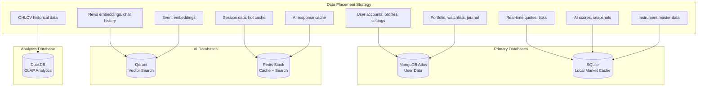

### 5.2 Database Comparison Matrix

| Database | Use Case | Pros | Cons | Praxis Role |
|:---|:---|:---|:---|:---|
| **MongoDB Atlas** | User data, profiles, portfolios | Flexible schema, cloud-managed, rich queries | Cost at scale, no local mode | Primary user data store |
| **SQLite (better-sqlite3)** | Local market cache, AI snapshots | Zero-config, fast reads, embedded, offline | Single-writer, no cloud sync | Local hot data + AI intelligence store |
| **DuckDB** | Historical OHLCV, analytics | Columnar, blazing fast OLAP, embedded | Not for OLTP, newer ecosystem | Analytics and backtesting |
| **Qdrant** | Vector search, embeddings | Rust-based performance, metadata filtering, local+cloud | Newer than Pinecone/Weaviate | RAG knowledge base + semantic search |
| **Redis Stack** | Cache, session, real-time | Sub-ms latency, pub/sub, JSON support | Volatile (RAM-based), cost | Hot cache + semantic response cache |

### 5.3 Data Placement Strategy

#### Recommended Architecture

| Data Type | Primary Store | Secondary/Archive | Why |
|:---|:---|:---|:---|
| **User accounts** | MongoDB | — | Flexible schema, cloud-accessible |
| **Watchlists** | MongoDB | localStorage (offline) | Multi-device sync via cloud |
| **Portfolio holdings** | MongoDB | SQLite (local mirror) | Cloud primary + offline fallback |
| **Journal entries** | MongoDB | Vector DB (embeddings) | Rich queries + semantic search |
| **Real-time quotes** | SQLite (WAL mode) | Redis (hot cache) | Fast writes + reads |
| **OHLCV candles** | DuckDB | — | Columnar optimal for time-series analytics |
| **Computed indicators** | SQLite | DuckDB (archive) | Fast read for current; analytics on history |
| **AI card scores** | SQLite (ai_card_store) | DuckDB (archive) | Existing pattern, works well |
| **News articles** | MongoDB | Vector DB (embeddings) | Structured storage + semantic retrieval |
| **Event data** | MongoDB | Vector DB (embeddings) | Same as news |
| **Chat conversations** | MongoDB | Vector DB (embeddings) | Persistence + RAG retrieval |
| **AI response cache** | Redis | — | Fast reads, TTL-based expiry |
| **User preferences** | MongoDB | localStorage | Cloud sync + offline |
| **Manual overrides** | localStorage | MongoDB (backup) | Per AGENTS.md rules |

#### Alternative: TimescaleDB instead of DuckDB for time-series

- **Why DuckDB:** Embedded (no server), zero-config, columnar storage is ideal for OHLCV analytics, excellent for backtesting queries
- **Why TimescaleDB might be better:** Native time-series features, continuous aggregates, better for concurrent writes
- **Tradeoffs:** TimescaleDB requires PostgreSQL server management; DuckDB is simpler but single-process

### 5.4 Vector Database Selection

**Recommended:** Qdrant (self-hosted or cloud)

| Feature | Qdrant | ChromaDB | Milvus | LanceDB | pgvector |
|:---|:---|:---|:---|:---|:---|
| **Performance** | ★★★★★ | ★★★ | ★★★★★ | ★★★★ | ★★★ |
| **Metadata Filtering** | ★★★★★ | ★★★ | ★★★★ | ★★★★ | ★★★★ |
| **Local Mode** | ✅ (Docker) | ✅ (In-process) | ❌ (Docker) | ✅ (In-process) | ❌ (Postgres) |
| **Cloud Mode** | ✅ | ✅ | ✅ | ✅ | ✅ |
| **Scalability** | High | Low-Medium | Very High | Medium | Medium |
| **Ease of Setup** | Medium | Very Easy | Hard | Easy | Medium |
| **Hybrid Search** | ✅ | ❌ | ✅ | ✅ | Partial |
| **Production Ready** | ✅ | Growing | ✅ | Growing | ✅ |

**Why Qdrant:** Best balance of performance, filtering (crucial for financial queries like "similar stocks in IT sector"), local + cloud modes, and production readiness.

**Alternative:** LanceDB for fully embedded (no Docker), or ChromaDB for simplest prototyping.

**Tradeoffs:** Qdrant requires Docker for self-hosted; LanceDB is simpler but less mature for production; ChromaDB may not scale.

### 5.5 Database Relationships

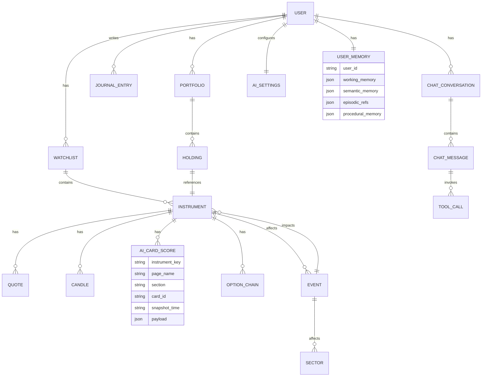

---

## 6. Memory Architecture

### 6.1 Memory Architecture Overview

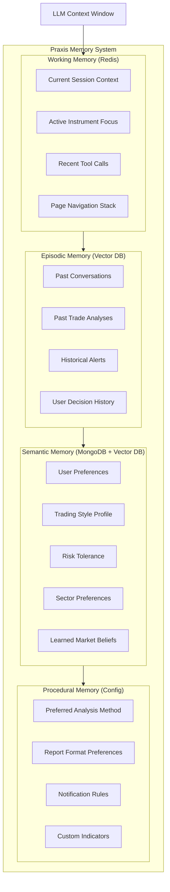

### 6.2 Memory Layer Specification

| Memory Type | Storage Backend | Capacity | TTL | Read Latency | Write Latency |
|:---|:---|:---|:---|:---|:---|
| **Working** | Redis | ~4K tokens | Session | <1ms | <1ms |
| **Episodic** | Vector DB (Qdrant) | Unlimited (paginated) | 90 days default | <50ms | <100ms |
| **Semantic** | MongoDB + Vector DB | ~100 facts/user | Permanent | <50ms | <100ms |
| **Procedural** | MongoDB | ~20 procedures/user | Permanent | <10ms | <10ms |

### 6.3 Memory Framework Selection

**Recommended:** Mem0

| Feature | Mem0 | Zep | Letta (MemGPT) |
|:---|:---|:---|:---|
| **Focus** | Memory-as-a-layer | Graph-centric temporal | LLM-native memory mgmt |
| **Storage** | Vector + Graph + KV | Temporal Knowledge Graph | LLM-managed paging |
| **Integration** | Framework-agnostic | Tight framework coupling | Requires Letta runtime |
| **Ease of Use** | ★★★★★ | ★★★★ | ★★★ |
| **Financial Suitability** | ★★★★ | ★★★★★ | ★★★ |
| **Self-Hosted** | ✅ | ✅ | ✅ |

**Why Mem0:** Framework-agnostic (works with any LLM provider), simple API, handles fact extraction automatically, supports hybrid storage. Integrates easily with Praxis's existing Node.js backend.

**Alternative:** Zep for better temporal reasoning (tracking how user preferences change over time — useful for evolving trading strategy).

**Tradeoffs:** Mem0 is simpler but less sophisticated at temporal relationships; Zep is more powerful but adds GraphQL complexity.

### 6.4 Memory Operations

| Operation | Trigger | Example |
|:---|:---|:---|
| **Store fact** | User states preference | "I prefer swing trading" → Semantic memory |
| **Store episode** | Conversation ends | Entire conversation → Episodic with embedding |
| **Recall facts** | New conversation starts | Load user's semantic memories into system prompt |
| **Recall episodes** | Relevant query detected | "Similar to our discussion about Reliance" → Vector search |
| **Update fact** | Contradiction detected | "Actually, I'm more of a scalper now" → Update semantic |
| **Forget** | User requests | "Forget my risk tolerance setting" → Delete from semantic |

---

## 7. RAG Architecture

### 7.1 RAG Pipeline Architecture

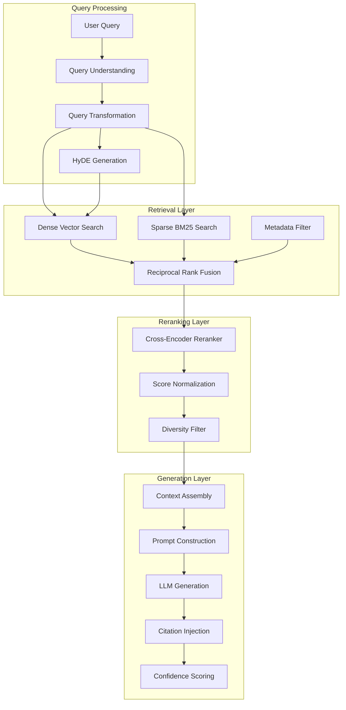

### 7.2 Knowledge Base Sources

| Source | Chunk Strategy | Embedding Model | Update Frequency |
|:---|:---|:---|:---|
| **News articles** | Semantic chunking (paragraph-level) | nomic-embed-text | Every 15 min |
| **Company announcements** | Structure-aware (section-level) | nomic-embed-text | Real-time |
| **Financial reports** | Parent-child hierarchical | nomic-embed-text | Quarterly |
| **RBI circulars** | Structure-aware | nomic-embed-text | On release |
| **User chat history** | Per-message with metadata | nomic-embed-text | On conversation close |
| **Trading journal entries** | Per-entry with rationale | nomic-embed-text | On entry creation |
| **Market analysis (AI-generated)** | Per-analysis document | nomic-embed-text | Per cron cycle |

### 7.3 Chunking Strategy

**Recommended:** Parent-Child Hierarchical Chunking

```
Document: "Reliance Q3 FY26 Earnings Report"
├── Parent Chunk (Section Level): "Revenue Analysis" (512-1024 tokens)
│   ├── Child Chunk 1: "Jio Platforms revenue grew 18% YoY..." (128-256 tokens)
│   ├── Child Chunk 2: "O2C segment showed improvement..." (128-256 tokens)
│   └── Child Chunk 3: "Retail business expanded..." (128-256 tokens)
├── Parent Chunk: "Profitability Analysis"
│   ├── Child Chunk 1: ...
│   └── Child Chunk 2: ...
└── Parent Chunk: "Outlook & Guidance"
    └── Child Chunk 1: ...

Strategy: Search on child chunks (more precise), return parent chunks (more context)
```

**Alternative:** Fixed-size chunking (512 tokens, 128 overlap)
- **Why Parent-Child:** Financial documents have natural section boundaries; child chunks improve retrieval precision while parent chunks provide context for accurate LLM generation
- **Tradeoffs:** More complex indexing logic; larger storage footprint (~2x)

### 7.4 Hybrid Search Configuration

```javascript
// Recommended search configuration
const searchConfig = {
  dense: {
    model: "nomic-embed-text",
    dimensions: 768,
    weight: 0.7,  // Dense gets higher weight for semantic queries
  },
  sparse: {
    algorithm: "BM25",
    weight: 0.3,  // Sparse catches exact terms (ticker symbols, numbers)
  },
  fusion: "reciprocal_rank_fusion",
  topK: 20,       // Retrieve 20 candidates
  rerankTopK: 5,   // Rerank to top 5
  reranker: "bge-reranker-v2-m3",
  metadataFilters: {
    // Example: filter by date range and sector
    dateRange: { gte: "2026-01-01" },
    sector: "IT"
  }
};
```

### 7.5 Anti-Hallucination RAG Safeguards

| Safeguard | Implementation | Purpose |
|:---|:---|:---|
| **Citation requirement** | Prompt instructs LLM to cite chunk IDs | Traceability |
| **Confidence threshold** | Only use chunks with relevance > 0.7 | Reduce noise |
| **"I don't know" training** | System prompt includes refusal patterns | Prevent fabrication |
| **Fact verification** | Post-generation check against structured data | Catch numerical errors |
| **Source attribution** | Every AI statement links to data source | Audit trail |

---

## 8. MCP Architecture

### 8.1 MCP Server Design

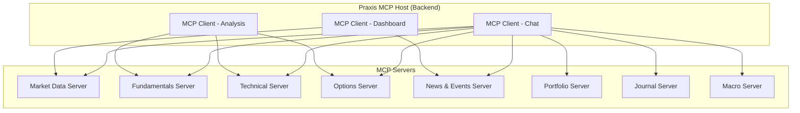

### 8.2 MCP Server Specifications

| Server | Tools (Functions) | Resources (Read-Only Data) | Prompts (Templates) |
|:---|:---|:---|:---|
| **Market Data** | `get_quote`, `get_ohlcv`, `subscribe_ticker` | `market_status`, `indices`, `sector_performance` | `market_overview_prompt` |
| **Fundamentals** | `get_fundamentals`, `get_scores`, `compare_peers` | `sector_averages`, `score_history` | `valuation_analysis_prompt` |
| **Technical** | `get_indicators`, `get_signals`, `detect_patterns` | `indicator_catalog`, `pattern_catalog` | `technical_analysis_prompt` |
| **Options** | `get_chain`, `get_greeks`, `get_gex`, `get_oi_changes` | `expiry_calendar`, `pcr_history` | `options_analysis_prompt` |
| **News & Events** | `search_news`, `get_events`, `classify_event` | `event_categories`, `news_sources` | `event_impact_prompt` |
| **Portfolio** | `get_holdings`, `get_pnl`, `get_allocation` | `portfolio_history`, `risk_metrics` | `portfolio_review_prompt` |
| **Journal** | `get_entries`, `search_journal`, `get_stats` | `trading_patterns`, `win_rate_history` | `trade_review_prompt` |
| **Macro** | `get_macro_indicator`, `get_correlations` | `economic_calendar`, `indicator_catalog` | `macro_outlook_prompt` |

### 8.3 MCP Design Best Practices for Praxis

| Practice | Implementation |
|:---|:---|
| **Outcome-First Design** | Tools named for outcomes ("get_valuation_assessment") not API mirrors |
| **Tool Limit** | Max 15 tools per server to avoid context bloat |
| **Deterministic Guardrails** | All tools are read-only; no trade execution via MCP |
| **Audit Logging** | Every tool call logged with user, timestamp, and parameters |
| **Error Handling** | Tools return structured errors with fallback suggestions |

---

## 9. AI Model Selection

### 9.1 Open Source LLM Comparison

| Model | Params | Context | License | VRAM (Q4) | Best For | Indian Market Support |
|:---|:---|:---|:---|:---|:---|:---|
| **Qwen3-8B** | 8B | 128K | Apache 2.0 | 6-8 GB | General tasks, embeddings | ★★★★ (multilingual) |
| **Qwen3-14B** | 14B | 128K | Apache 2.0 | 10-12 GB | Analysis, reasoning | ★★★★ (multilingual) |
| **Qwen3-32B** | 32B | 128K | Apache 2.0 | 20-24 GB | Complex reasoning | ★★★★★ |
| **DeepSeek V4-14B** | 14B | 128K | MIT | 10-12 GB | Math, reasoning | ★★★ |
| **Llama 4-Scout** | 17B (MoE) | 10M | Llama License | 12-16 GB | General + long context | ★★★ |
| **Mistral Large 3** | 123B (MoE) | 128K | Apache 2.0 | 40+ GB | Enterprise reasoning | ★★★ |
| **Phi-4** | 14B | 16K | MIT | 10-12 GB | Efficient reasoning | ★★★ |
| **Gemma 3** | 27B | 128K | Gemma License | 16-20 GB | Quality/efficiency balance | ★★★ |

### 9.2 Cloud LLM API Comparison

| Provider | Model | Input $/1M | Output $/1M | Context | Best For |
|:---|:---|:---|:---|:---|:---|
| **Google** | Gemini 2.5 Flash | $0.15 | $0.60 | 1M | High-volume, cost-effective |
| **Google** | Gemini 2.5 Pro | $1.25 | $10.00 | 1M | Complex reasoning |
| **Anthropic** | Claude Sonnet 4 | $3.00 | $15.00 | 200K | Best analysis quality |
| **Anthropic** | Claude Haiku 3.5 | $0.80 | $4.00 | 200K | Fast, good quality |
| **OpenAI** | GPT-4o | $2.50 | $10.00 | 128K | Vision + chat |
| **DeepSeek** | V4 Pro | $0.44 | $0.87 | 1M | Cost-effective reasoning |
| **DeepSeek** | V4 Flash | $0.14 | $0.28 | 1M | Ultra-cheap batch |

### 9.3 Model Selection by Task

| Task Category | Recommended | Alternative | Why |
|:---|:---|:---|:---|
| **Per-Card AI Insight** | Local Qwen3-8B | Local Phi-4 | High volume, simple reasoning, privacy |
| **Stock-Level Analysis** | Local Qwen3-14B | Cloud Gemini Flash | Balance of quality and cost |
| **Event Impact Assessment** | Cloud Gemini 2.5 Flash | Cloud Claude Haiku | Needs broad knowledge, cost-effective |
| **Complex Reasoning** | Cloud Claude Sonnet 4 | Cloud Gemini Pro | Best reasoning quality for financial analysis |
| **Chat (Conversational)** | Cloud Gemini 2.5 Flash | Cloud Claude Sonnet | Good quality, fast, cost-effective |
| **Report Generation** | Cloud Claude Sonnet 4 | Cloud GPT-4o | Best writing quality |
| **Chart Understanding** | Cloud GPT-4o Vision | Cloud Gemini Pro Vision | Best chart interpretation |
| **News Classification** | Local Qwen3-8B | FinBERT | High volume, simple classification |
| **Embedding** | Local nomic-embed-text | Local BGE-M3 | Fast, free, good quality |
| **Reranking** | Local BGE-reranker-v2-m3 | Cohere Rerank API | Free, good quality |

### 9.4 Model Routing Strategy

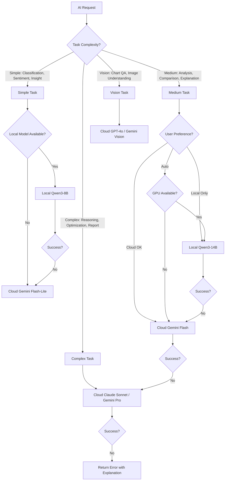

---

## 10. Local AI Architecture

### 10.1 Local Inference Stack

**Recommended:** Ollama

| Runtime | Pros | Cons | Praxis Recommendation |
|:---|:---|:---|:---|
| **Ollama** | Easiest setup, REST API, model library, cross-platform | Slightly slower than raw llama.cpp | ✅ Primary |
| **llama.cpp** | Fastest inference, most quantization options | No built-in model management, CLI-focused | Alternative for power users |
| **LM Studio** | Beautiful GUI, easy model browsing | GUI dependency, less scriptable | Not recommended (no API stability) |
| **vLLM** | Production-grade, batching, PagedAttention | Requires CUDA, complex setup, Linux-focused | Future enterprise deployment |

### 10.2 Local Model Deployment

```
Praxis Local AI Stack:
├── Ollama Server (background service)
│   ├── qwen3:8b (always loaded — 6GB VRAM)
│   ├── qwen3:14b (loaded on demand — 12GB VRAM)
│   ├── nomic-embed-text (always loaded — 300MB VRAM)
│   └── bge-reranker-v2-m3 (loaded on demand — 1GB VRAM)
├── Praxis AI Service (Node.js)
│   ├── Ollama Client (REST API calls)
│   ├── Model Health Monitor
│   └── Fallback-to-Cloud Logic
└── GPU Monitor
    ├── VRAM Usage Tracker
    └── Auto-unload idle models
```

### 10.3 When to Use Local vs Cloud

| Criterion | Use Local | Use Cloud |
|:---|:---|:---|
| **Data Sensitivity** | Portfolio, journal, personal analysis | Public market data, news |
| **Latency** | <500ms needed, cached results | >1s acceptable |
| **Volume** | High-frequency (per-indicator insights, batch) | Low-frequency (reports, complex queries) |
| **Complexity** | Simple classification, scoring | Multi-step reasoning, long context |
| **Context Size** | <8K tokens | >8K tokens |
| **Internet** | Offline mode | Online required |
| **Cost** | Zero marginal cost after GPU | Pay-per-token |

### 10.4 Offline Mode

When internet is unavailable, Praxis should:

1. **Continue working:** All cached data remains accessible
2. **Local AI still functions:** Ollama models run locally
3. **Degrade gracefully:** Cloud-dependent features show "Offline — limited AI" banner
4. **Queue cloud requests:** Store pending cloud requests, execute when online
5. **No data loss:** All user actions stored locally, synced when online

### 10.5 GPU Requirements for Praxis

| User Tier | GPU | VRAM | Models Loadable | Experience |
|:---|:---|:---|:---|:---|
| **Minimum** | No GPU (CPU only) | 0 | Qwen3-1.5B (Q4) | Slow but functional |
| **Basic** | RTX 3060 / 4060 | 8-12 GB | Qwen3-8B (Q4) + Embedding | Good for basic insights |
| **Recommended** | RTX 3080 / 4070 Ti | 12-16 GB | Qwen3-14B (Q4) + Embedding + Reranker | Full local AI experience |
| **Power** | RTX 4090 / 5080 | 24-32 GB | Qwen3-32B (Q4) + all support models | Near-cloud quality locally |
| **Enterprise** | 2x RTX 4090 / A6000 | 48+ GB | Qwen3-72B (Q4) | Cloud-competitive |

### 10.6 CPU Fallback Strategy

When no GPU is available:

1. **Use smallest model:** Qwen3-1.5B or Phi-3-mini (3.8B)
2. **Aggressive quantization:** Q4_0 or Q2_K
3. **Batch processing:** Queue AI requests, process sequentially
4. **Cloud prioritization:** Route complex tasks to cloud
5. **Reduced features:** Disable pattern detection, limit per-card insights
6. **Expected performance:** ~5-15 tokens/second on modern 8-core CPU

---

## 11. Cloud AI Architecture

### 11.1 Multi-Provider Architecture

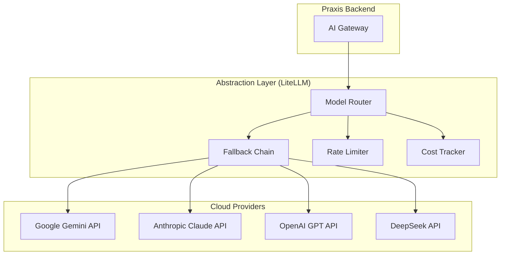

### 11.2 Provider Fallback Chain

```
Primary:     Gemini 2.5 Flash  (lowest cost, 1M context)
Fallback 1:  DeepSeek V4 Flash (ultra-cheap, good reasoning)
Fallback 2:  Claude Haiku 3.5  (reliable, good quality)
Fallback 3:  GPT-4o-mini       (widely available)

For Complex/Pro Tasks:
Primary:     Claude Sonnet 4   (best reasoning)
Fallback 1:  Gemini 2.5 Pro    (good reasoning, large context)
Fallback 2:  GPT-4o            (reliable, good vision)

For Vision Tasks:
Primary:     GPT-4o            (best chart understanding)
Fallback 1:  Gemini 2.5 Pro    (good vision)
Fallback 2:  Claude Sonnet 4   (adequate vision)
```

### 11.3 Cost Optimization Strategies

| Strategy | Impact | Implementation |
|:---|:---|:---|
| **Semantic Caching** | 40-60% cost reduction | Cache similar queries with embedding similarity |
| **Prompt Caching** | 50-90% input cost reduction | Use provider prompt caching features |
| **Batch API** | 50% cost reduction | Queue non-urgent requests for batch processing |
| **Model Routing** | 60-80% cost reduction | Route simple tasks to cheap models |
| **Response Reuse** | 20-30% cost reduction | Share universal analyses across users |
| **Token Optimization** | 10-20% cost reduction | Compress prompts, use structured output |

### 11.4 Monthly Cost Estimates

| Users | Cloud Requests/Day | Avg Tokens/Request | Model Mix | Est. Monthly Cost |
|:---|:---|:---|:---|:---|
| 1 (developer) | 100 | 2K in / 1K out | 80% Flash / 20% Pro | $5-15 |
| 100 | 5,000 | 2K in / 1K out | 80% Flash / 20% Pro | $50-150 |
| 1,000 | 30,000 | 2K in / 1K out | 85% Flash / 15% Pro | $300-800 |
| 10,000 | 200,000 | 2K in / 1K out | 90% Flash / 10% Pro | $2,000-5,000 |
| 100,000 | 1,000,000 | 2K in / 1K out | 95% Flash / 5% Pro | $10,000-25,000 |

*Assumes semantic caching reduces effective requests by 40%*

---

## 12. Embedding & Vector Search

### 12.1 Embedding Model Selection

**Recommended:** nomic-embed-text (via Ollama)

| Model | Type | Dimensions | MTEB Score | Speed | Cost |
|:---|:---|:---|:---|:---|:---|
| **nomic-embed-text** | Local (Ollama) | 768 | 62.3 | Fast | Free |
| **BGE-M3** | Local (Ollama) | 1024 | 64.1 | Medium | Free |
| **Qwen3-Embedding-0.6B** | Local (Ollama) | 1024 | 63.5 | Fast | Free |
| **text-embedding-3-small** | Cloud (OpenAI) | 1536 | 62.3 | Fast | $0.02/1M |
| **text-embedding-3-large** | Cloud (OpenAI) | 3072 | 64.6 | Medium | $0.13/1M |
| **Gemini Embedding** | Cloud (Google) | 3072 | 65.2 | Fast | $0.01/1M |

**Why nomic-embed-text:** Free (runs locally), fast, good quality, 8K context window, supports Matryoshka (dimension reduction). Zero per-token cost enables high-volume embedding of news, events, and chat history.

**Alternative:** BGE-M3 for multilingual support (Hindi market news) or Gemini Embedding for highest quality cloud option at minimal cost.

**Tradeoffs:** Local models are free but require GPU memory (~300MB for nomic); cloud models are higher quality but add latency and cost.

### 12.2 Embedding Pipeline

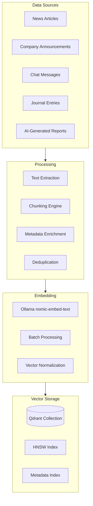

### 12.3 Reranking Architecture

**Recommended:** BGE-reranker-v2-m3 (local via Ollama)

| Reranker | Type | Quality | Speed | Cost |
|:---|:---|:---|:---|:---|
| **BGE-reranker-v2-m3** | Local | ★★★★ | ~50ms/query | Free |
| **jina-reranker-v2** | Local | ★★★★ | ~60ms/query | Free |
| **Cohere Rerank** | Cloud API | ★★★★★ | ~100ms/query | $2/1K queries |
| **Cross-encoder** | Local (custom) | ★★★★ | ~80ms/query | Free |

**Why BGE-reranker:** Best quality among free local rerankers. Runs efficiently on CPU. Critical for financial RAG where precision matters (retrieving the right earnings report section, not a similar one from a different quarter).

---

## 13. Prompt Engineering

### 13.1 Prompt Architecture

```
┌──────────────────────────────────────────────────────┐
│ SYSTEM PROMPT (Persistent)                            │
│ ├── Role Definition                                   │
│ ├── Behavioral Constraints                            │
│ ├── Output Format Specification                       │
│ ├── Anti-Hallucination Rules                          │
│ └── Financial Disclaimer                              │
├──────────────────────────────────────────────────────┤
│ CONTEXT INJECTION (Dynamic)                           │
│ ├── User Memory (from Mem0)                           │
│ ├── RAG Context (retrieved chunks)                    │
│ ├── Current Instrument Data                           │
│ ├── Market Regime                                     │
│ └── Page-Specific Context                             │
├──────────────────────────────────────────────────────┤
│ USER MESSAGE (Dynamic)                                │
│ ├── Current query / task                              │
│ └── Conversation history (last N turns)               │
├──────────────────────────────────────────────────────┤
│ OUTPUT SCHEMA (Structured)                            │
│ ├── JSON Schema for structured output                 │
│ ├── Confidence score field                            │
│ └── Reasoning chain field                             │
└──────────────────────────────────────────────────────┘
```

### 13.2 System Prompt Templates

#### Financial Analysis System Prompt

```
You are Praxis AI, an institutional-grade financial intelligence system 
specializing in the Indian stock market (NSE/BSE).

RULES:
1. NEVER hallucinate. If data is missing, say "insufficient data."
2. ALWAYS cite the data source for every claim.
3. ALWAYS include a confidence score (0-100%) for predictions.
4. ALWAYS explain your reasoning step-by-step.
5. NEVER provide buy/sell recommendations. Provide analysis only.
6. Use Indian market conventions (₹, crore/lakh, IST timezone).
7. When uncertain between multiple interpretations, present ALL of them.

OUTPUT FORMAT:
- analysis: string (2-5 sentences of clear analysis)
- confidence: number (0-100)
- reasoning: string[] (step-by-step reasoning chain)
- data_sources: string[] (what data was used)
- caveats: string[] (limitations or assumptions)

FINANCIAL DISCLAIMER:
This analysis is for informational purposes only and does not constitute 
investment advice. Past performance is not indicative of future results.
```

#### Event Classification System Prompt

```
You are an event classification engine for Indian stock markets.

Given a news article or event, classify it into the following schema:
{
  category: ECONOMIC | CORPORATE | GOVERNMENT | MONETARY_POLICY | GLOBAL | 
            GEOPOLITICAL | EARNINGS | IPO | COMMODITY | WEATHER | POLITICAL | REGULATORY,
  sentiment: { label: BULLISH|MILDLY_BULLISH|NEUTRAL|MILDLY_BEARISH|BEARISH, score: -1.0 to 1.0 },
  severity: { label: CRITICAL|HIGH|MEDIUM|LOW|NEGLIGIBLE, score: 1-10 },
  confidence: 0.0 to 1.0,
  market_impact: { direction: UP|DOWN|NEUTRAL, magnitude: LOW|MEDIUM|HIGH, probability: 0-1, duration: IMMEDIATE|SHORT_TERM|MEDIUM_TERM|LONG_TERM },
  affected_sectors: string[],
  affected_indices: string[],
  affected_stocks: [{ symbol, direction, magnitude }],
  time_horizon: IMMEDIATE | SHORT_TERM | MEDIUM_TERM | LONG_TERM,
  risk_score: 0.0 to 10.0,
  explanation: string (2-5 sentences)
}

RULES:
1. Base severity on actual market impact potential, not headline sensationalism.
2. Be conservative with confidence — if uncertain, lower the score.
3. For affected stocks, only list stocks with DIRECT impact, not tangential.
4. Indian market context: know NSE sector indices, major Nifty50 constituents.
```

### 13.3 Chain-of-Thought Patterns

| Pattern | Use Case | Example |
|:---|:---|:---|
| **Standard CoT** | Fundamental analysis | "Step 1: Evaluate PE ratio... Step 2: Compare to sector..." |
| **Self-Consistency** | Prediction confidence | Generate 3 analyses, check consensus |
| **Tree-of-Thought** | Strategy evaluation | Branch into bull/bear/neutral scenarios |
| **ReAct** | Tool-calling agent | Reason → Act (call tool) → Observe → Reason |
| **Step-Back** | Complex questions | "Before answering, let me identify the key factors..." |

### 13.4 Anti-Hallucination Techniques

| Technique | Implementation | Effectiveness |
|:---|:---|:---|
| **Grounding** | Always provide source data in prompt | ★★★★★ |
| **Retrieval verification** | Cross-check AI claims against structured data | ★★★★★ |
| **Confidence calibration** | Force model to output confidence with every claim | ★★★★ |
| **Structured output** | JSON mode forces factual responses | ★★★★ |
| **"I don't know" training** | System prompt with explicit refusal patterns | ★★★★ |
| **Temperature control** | Low temperature (0.1-0.3) for factual tasks | ★★★ |
| **Source citation** | Require citations for every analytical claim | ★★★★★ |

---

## 14. Fine-Tuning Requirements

### 14.1 Fine-Tuning Decision Matrix

| Task | Fine-Tune? | Why / Why Not |
|:---|:---|:---|
| **Event Classification** | ✅ Yes (eventually) | Domain-specific categories, Indian market context |
| **Sentiment Analysis** | ⚠️ Maybe | FinBERT exists; Indian market nuances may need tuning |
| **Indicator Insights** | ❌ No | Template-driven logic + few-shot prompting sufficient |
| **Report Generation** | ❌ No | Cloud models write well enough |
| **Chat Conversations** | ❌ No | General models excel at conversation |
| **Pattern Recognition** | ✅ Yes | CNN needs training on Indian market chart patterns |
| **NER for Indian Markets** | ✅ Yes | Indian company names, ticker formats |

### 14.2 Fine-Tuning Roadmap

| Phase | Timeline | Task | Base Model | Training Data |
|:---|:---|:---|:---|:---|
| **Phase 1** | Month 6-8 | Indian market NER | spaCy/DistilBERT | 10K annotated Indian market texts |
| **Phase 2** | Month 9-12 | Event classifier | Qwen3-8B (LoRA) | 5K classified Indian market events |
| **Phase 3** | Month 12-18 | Chart pattern CNN | ResNet-50 / EfficientNet | 50K labeled chart pattern images |
| **Phase 4** | Month 18-24 | Financial sentiment | FinBERT variant | 20K Indian market sentiment labels |

### 14.3 Training Data Requirements

| Model | Data Type | Volume | Source |
|:---|:---|:---|:---|
| Event Classifier | Labeled event JSON | 5,000-10,000 events | Manual annotation from historical news |
| NER Model | Annotated text | 10,000 sentences | NSE filings, MoneyControl articles |
| Chart Pattern CNN | Labeled chart images | 50,000+ images | Generated from historical OHLCV data |
| Sentiment Model | Labeled sentiment | 20,000 texts | Financial news + social media |

---

## 15. AI Gateway & Orchestration

### 15.1 AI Gateway Implementation

**Recommended:** Custom Node.js gateway + LiteLLM for provider abstraction

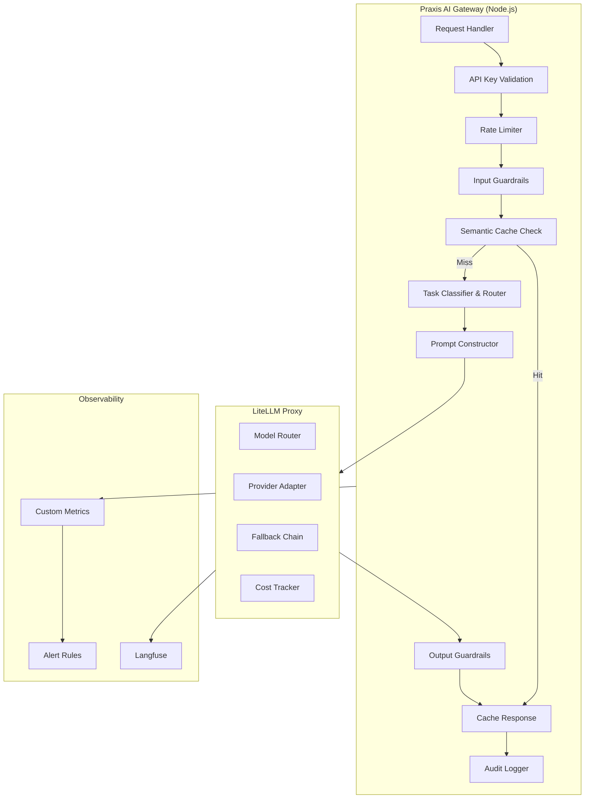

### 15.2 Observability Stack

**Recommended:** Langfuse (open-source, self-hosted)

| Tool | Purpose | Deployment | Cost |
|:---|:---|:---|:---|
| **Langfuse** | Trace, evaluate, debug LLM calls | Self-hosted (Docker) | Free |
| **Custom Metrics** | Latency, cost, error rate dashboards | Node.js metrics | Free |
| **Alert Rules** | Cost spike, latency degradation, error burst | Custom | Free |

**Alternative:** LangSmith (Managed SaaS by LangChain)
- **Why Langfuse:** Open-source, self-hosted (data sovereignty), free, good integration
- **Tradeoffs:** Langfuse has fewer features than LangSmith but avoids vendor lock-in

### 15.3 Evaluation Framework

| Metric | Measurement | Target |
|:---|:---|:---|
| **Factual Accuracy** | Compare AI claims vs structured data | >95% |
| **Relevance** | RAGAS relevance score | >0.8 |
| **Faithfulness** | RAGAS faithfulness score (no hallucination) | >0.9 |
| **Latency (P50)** | Request to first token | <1s |
| **Latency (P99)** | Request to last token | <10s |
| **Cost per request** | Total token cost | <$0.005 avg |
| **User satisfaction** | Thumbs up/down on AI outputs | >80% positive |

---

## 16. API Provider Architecture

### 16.1 Free APIs

#### Market Data APIs

| API | Data Provided | Rate Limit | Indian Market | Notes |
|:---|:---|:---|:---|:---|
| **Upstox API** (current) | Real-time quotes, OHLCV, F&O, Fundamentals | Moderate | ★★★★★ | Primary — requires demat account |
| **Angel One SmartAPI** | Real-time quotes, Historical, F&O | Moderate | ★★★★★ | Best alternative free API |
| **DhanHQ API** | Trading + Data (free with 25 trades/month) | Moderate | ★★★★★ | Good options chain API |
| **FYERS API** | Real-time + Historical | Moderate | ★★★★ | Free for account holders |
| **Alpha Vantage** | Global stocks, Forex, Crypto, News | 25 req/day (free) | ★★ | Good for global data |
| **Yahoo Finance (unofficial)** | Global stocks, fundamentals | Unofficial | ★★★ | Unreliable, may break |

#### News APIs

| API | Coverage | Free Tier | Indian News | Quality |
|:---|:---|:---|:---|:---|
| **Google News RSS** | Global | Unlimited | ★★★★ | No API key needed |
| **NewsAPI.org** | Global | 100 req/day | ★★★ | Good but limited free tier |
| **GNews** | Global | 100 req/day | ★★★ | Alternative to NewsAPI |
| **Mediastack** | Global | 500 req/month | ★★★ | Good India coverage |

#### Economic Data APIs

| API | Coverage | Free Tier | Indian Data | Notes |
|:---|:---|:---|:---|:---|
| **FRED API** | US Macro | Unlimited | ★ (US only) | Gold standard for US data |
| **Trading Economics** | Global Macro | Limited free | ★★★★ | Good India coverage |
| **World Bank API** | Development indicators | Unlimited | ★★★ | Annual data only |
| **RBI Database** | India monetary data | Free | ★★★★★ | Official source |

#### Other Free APIs

| Category | API | Free Tier |
|:---|:---|:---|
| **Forex** | ExchangeRate-API, Fixer.io | 1,500 req/month |
| **Weather** | OpenWeatherMap | 1,000 req/day |
| **Notifications** | Firebase Cloud Messaging | Unlimited |
| **OCR** | Tesseract.js (local) | Unlimited |
| **Speech (STT)** | Whisper (local via Ollama) | Unlimited |
| **TTS** | Coqui TTS (local) | Unlimited |
| **Embeddings** | Ollama (local) | Unlimited |

### 16.2 Paid APIs — When to Upgrade

| API | Price | When Worthwhile |
|:---|:---|:---|
| **TrueData** | ₹500-2000/month | When you need tick-by-tick data for HFT analysis |
| **GlobalDataFeeds** | ₹1000-5000/month | When Upstox rate limits become a bottleneck |
| **Polygon.io** | $29-199/month | When you add US market coverage |
| **NewsAPI Premium** | $449/month | When you need unlimited news search |
| **Benzinga** | $99-499/month | When you need institutional-grade news + earnings |
| **Bloomberg B-PIPE** | $$$$ (enterprise) | When you're managing >₹100 Cr AUM |
| **Refinitiv (LSEG)** | $$$$ (enterprise) | When you need Level 2 data + global coverage |

---

## 17. GPU Requirements

### 17.1 Consumer GPU Comparison for Praxis

| GPU | VRAM | Bandwidth | Price (₹) | Max Model (Q4) | Praxis Tier |
|:---|:---|:---|:---|:---|:---|
| **RTX 3060** | 12 GB | 360 GB/s | ~25,000 | Qwen3-8B | Basic |
| **RTX 4060 Ti** | 16 GB | 288 GB/s | ~35,000 | Qwen3-14B | Good |
| **RTX 4070 Ti Super** | 16 GB | 672 GB/s | ~55,000 | Qwen3-14B (fast) | Good+ |
| **RTX 3090** | 24 GB | 936 GB/s | ~50,000 (used) | Qwen3-32B | Recommended |
| **RTX 4090** | 24 GB | 1,008 GB/s | ~1,50,000 | Qwen3-32B (fast) | Power |
| **RTX 5080** | 16 GB | 960 GB/s | ~1,10,000 | Qwen3-14B (very fast) | Good+ |
| **RTX 5090** | 32 GB | 1,792 GB/s | ~2,50,000+ | Qwen3-32B+ | Power+ |

### 17.2 Simultaneous Model Loading

| VRAM Available | Models Loadable Simultaneously |
|:---|:---|
| **8 GB** | Qwen3-8B Q4 (5GB) + nomic-embed (300MB) |
| **12 GB** | Qwen3-8B Q4 (5GB) + nomic-embed (300MB) + reranker (1GB) |
| **16 GB** | Qwen3-14B Q4 (10GB) + nomic-embed (300MB) + reranker (1GB) |
| **24 GB** | Qwen3-32B Q4 (20GB) + nomic-embed (300MB) |
| **32 GB** | Qwen3-32B Q4 (20GB) + nomic-embed (300MB) + reranker (1GB) + headroom |

### 17.3 Server/Cloud GPU Options

| Provider | GPU | VRAM | Price/Hour | Use Case |
|:---|:---|:---|:---|:---|
| **RunPod** | RTX 4090 | 24 GB | ~$0.44 | Development, testing |
| **RunPod** | A100 80GB | 80 GB | ~$1.64 | Production local models |
| **Vast.ai** | RTX 4090 | 24 GB | ~$0.30 | Cheapest GPU cloud |
| **Lambda** | H100 | 80 GB | ~$2.49 | Enterprise production |
| **AWS** | g5.xlarge (A10G) | 24 GB | ~$1.01 | AWS ecosystem integration |
| **GCP** | L4 | 24 GB | ~$0.81 | GCP ecosystem |

---

## 18. Security Architecture

### 18.1 AI Security Threat Model

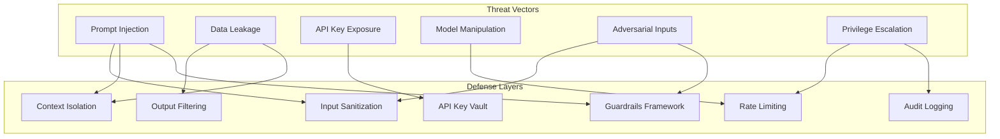

### 18.2 Security Controls

| Control | Implementation | Priority |
|:---|:---|:---|
| **Prompt Injection Defense** | XML tag delimiters between system/user/data; input pattern matching | Critical |
| **Data Isolation** | Per-user context isolation; no cross-user data in prompts | Critical |
| **PII Detection** | Regex + NER-based PII scanning on AI outputs | High |
| **API Key Management** | `.env` files + environment variables; never in prompts or logs | Critical |
| **Output Sanitization** | Filter financial advice, trading signals from AI outputs | High |
| **Rate Limiting** | Per-user, per-minute, per-day AI request limits | High |
| **Audit Logging** | Log all AI requests/responses (with PII redaction) | High |
| **Input Length Limits** | Max 10K characters for user input to AI | Medium |
| **Model Access Control** | Role-based access to AI features (free vs premium) | Medium |
| **Guardrails** | NeMo Guardrails for dialog rails and topic control | High |

### 18.3 OWASP LLM Top 10 Mitigations

| Risk | Praxis Mitigation |
|:---|:---|
| **LLM01: Prompt Injection** | Input sanitization, context separation, guardrails |
| **LLM02: Sensitive Info Disclosure** | Output filtering, PII detection, data isolation |
| **LLM03: Supply Chain** | Pin model versions, verify model checksums |
| **LLM04: Data/Model Poisoning** | Use trusted model sources (Ollama, HuggingFace verified) |
| **LLM05: Improper Output Handling** | Structured output validation, no raw HTML/JS injection |
| **LLM06: Excessive Agency** | Read-only tools, no trade execution, HITL for all actions |
| **LLM07: System Prompt Leakage** | Never expose system prompts; test for extraction |
| **LLM08: Vector/Embedding Weaknesses** | Input validation before embedding; metadata filtering |
| **LLM09: Misinformation** | Citation requirements, confidence scores, disclaimers |
| **LLM10: Unbounded Consumption** | Rate limiting, token budgets per request, cost alerts |

### 18.4 Encrypted Storage

| Data | Encryption Method | Key Management |
|:---|:---|:---|
| API keys | AES-256 at rest | Environment variables |
| User credentials | bcrypt hashing | MongoDB |
| Trading journal | Application-level encryption | User-specific key |
| Chat history | AES-256 at rest | Per-user key |
| Portfolio data | TLS in transit, encrypted at rest | MongoDB Atlas encryption |
| Local SQLite | SQLCipher (optional) | Machine-specific key |

---

## 19. Scalability Architecture

### 19.1 Scalability Tiers

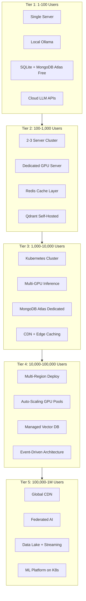

### 19.2 Detailed Tier Specifications

| Aspect | 100 Users | 1K Users | 10K Users | 100K Users | 1M Users |
|:---|:---|:---|:---|:---|:---|
| **Servers** | 1 (4 vCPU, 16GB) | 3 (8 vCPU, 32GB) | K8s (10 nodes) | K8s (50 nodes) | K8s (200+ nodes) |
| **GPU** | 1x RTX 4090 local | 1x A100 cloud | 4x A100 | 16x H100 | 64x H100 |
| **Database** | MongoDB Free + SQLite | MongoDB M10 + Redis | MongoDB M30 + Redis Cluster | MongoDB M50 + Redis Enterprise | MongoDB Atlas Global + TimescaleDB |
| **Vector DB** | Qdrant Docker | Qdrant 2-node | Qdrant Cloud | Qdrant Cloud Enterprise | Qdrant Cloud (multi-region) |
| **CDN** | None | CloudFlare Free | CloudFlare Pro | CloudFlare Enterprise | Multi-CDN |
| **AI Requests/day** | ~500 | ~5K | ~50K | ~500K | ~5M |
| **Est. Monthly Cost** | $50-100 | $300-800 | $3K-8K | $20K-50K | $100K-250K |

### 19.3 Horizontal Scaling Strategy

| Component | Scaling Method | Trigger |
|:---|:---|:---|
| **API Server** | Horizontal pod autoscaling | CPU > 70% or request latency > 2s |
| **AI Gateway** | Horizontal scaling + load balancer | Request queue depth > 100 |
| **Ollama Workers** | GPU pool with scheduler | GPU utilization > 80% |
| **WebSocket** | Sticky sessions + Redis adapter | Connection count > 10K/server |
| **Vector DB** | Shard by collection | Collection size > 1M vectors |
| **Redis** | Redis Cluster (hash slots) | Memory > 80% capacity |

---

## 20. Open Source Ecosystem

### 20.1 Complete Open Source Stack

| Category | Recommended | Alternative | License |
|:---|:---|:---|:---|
| **LLM (General)** | Qwen3-14B | DeepSeek V4-14B | Apache 2.0 / MIT |
| **LLM (Reasoning)** | Qwen3-32B | DeepSeek R1 distill | Apache 2.0 / MIT |
| **LLM (Small/Fast)** | Qwen3-8B | Phi-4 | Apache 2.0 / MIT |
| **Vision LLM** | Qwen-VL | LLaVA 1.6 | Apache 2.0 |
| **Embedding** | nomic-embed-text | BGE-M3 | Apache 2.0 |
| **Reranker** | BGE-reranker-v2-m3 | jina-reranker-v2 | Apache 2.0 |
| **OCR** | Surya | PaddleOCR | GPL-3.0 / Apache 2.0 |
| **STT** | Whisper (large-v3) | Faster-Whisper | MIT |
| **TTS** | Coqui TTS / Piper | Edge-TTS (Microsoft) | MPL 2.0 / MIT |
| **NER** | spaCy (en_core_web_trf) | Flair | MIT |
| **Sentiment** | FinBERT | Twitter-roBERTa | Apache 2.0 |
| **Runtime** | Ollama | llama.cpp | MIT |
| **Vector DB** | Qdrant | ChromaDB | Apache 2.0 |
| **Agent Framework** | LangGraph | LlamaIndex Workflows | MIT |
| **Memory** | Mem0 | Zep | Apache 2.0 |
| **Observability** | Langfuse | Phoenix (Arize) | MIT / Apache 2.0 |
| **AI Gateway** | LiteLLM | Custom | MIT |
| **Guardrails** | NeMo Guardrails | LLM Guard | Apache 2.0 / MIT |
| **Image Gen** | SDXL / Flux | Stable Diffusion 3 | Apache 2.0 |
| **Chart** | Lightweight-Charts (TradingView) | D3.js | Apache 2.0 |

---

## 21. Cost Analysis

### 21.1 Development Phase Costs (0-6 months)

| Item | Monthly Cost | Notes |
|:---|:---|:---|
| **Cloud LLM APIs** | $20-50 | Development testing |
| **MongoDB Atlas** | $0 (Free tier) | M0 free tier |
| **GPU Cloud (testing)** | $50-100 | RunPod/Vast.ai spot |
| **Qdrant Cloud** | $0 (free tier) | 1GB free storage |
| **News APIs** | $0 (free tiers) | Multiple free sources |
| **Domain + Hosting** | $10-20 | Basic hosting |
| **Total** | **$80-170/month** | |

### 21.2 Launch Phase Costs (6-12 months, ~100 users)

| Item | Monthly Cost | Notes |
|:---|:---|:---|
| **Cloud LLM APIs** | $100-300 | Gemini Flash primary |
| **MongoDB Atlas** | $57 (M10) | Dedicated cluster |
| **GPU Server** | $150-300 | RunPod A40/A100 |
| **Redis Cloud** | $0-7 | Free tier or essentials |
| **Qdrant Cloud** | $25-50 | Starter plan |
| **CDN + Hosting** | $20-50 | CloudFlare + Railway/Fly.io |
| **Total** | **$350-700/month** | |

### 21.3 Growth Phase Costs (12-24 months, ~1,000 users)

| Item | Monthly Cost | Notes |
|:---|:---|:---|
| **Cloud LLM APIs** | $500-1,500 | With caching optimization |
| **MongoDB Atlas** | $200 (M30) | Better performance |
| **GPU Cluster** | $500-1,000 | Multi-GPU for inference |
| **Redis** | $50-100 | More cache capacity |
| **Qdrant** | $100-200 | Growth plan |
| **Infrastructure** | $200-400 | K8s, monitoring |
| **Total** | **$1,500-3,200/month** | |

---

## 22. Future Roadmap

### 22.1 AI Features Roadmap

| Timeline | Feature | AI Technology | Priority |
|:---|:---|:---|:---|
| **Q3 2026** | Per-card AI insights (Local) | Ollama + Qwen3-8B | Critical |
| **Q3 2026** | AI Chat MVP | Cloud Gemini Flash + tools | Critical |
| **Q4 2026** | Event intelligence pipeline | NLP + Cloud Flash | High |
| **Q4 2026** | Memory system (Mem0) | Mem0 + Qdrant | High |
| **Q1 2027** | RAG knowledge base | Qdrant + nomic-embed | High |
| **Q1 2027** | Technical signal generation | Local 14B + deterministic | High |
| **Q2 2027** | Chart pattern recognition | CNN + Vision LLM | Medium |
| **Q2 2027** | Portfolio AI advisor | Cloud Pro + RAG | Medium |
| **Q3 2027** | Trading journal AI | Memory + RAG + Cloud | Medium |
| **Q3 2027** | AI-generated reports | Cloud Pro + templates | Medium |
| **Q4 2027** | Voice interface (STT/TTS) | Whisper + Coqui | Low |
| **Q4 2027** | Strategy builder AI | Cloud Pro + backtesting | Medium |
| **2028** | Multi-language support (Hindi) | Multilingual models | Medium |
| **2028** | Real-time NLP news processing | Edge-deployed models | Medium |
| **2028** | Predictive analytics | Fine-tuned forecasting | Low |
| **2029+** | Autonomous analysis agents | Multi-agent orchestration | Low |

### 22.2 Model Evolution Strategy

| Year | Expected Model Landscape | Praxis Strategy |
|:---|:---|:---|
| **2026** | Qwen3, DeepSeek V4, Gemini 2.5 | Use current generation; build abstraction layer |
| **2027** | Qwen4, Llama 5, Gemini 3 | Upgrade local models; benefit from better reasoning |
| **2028** | 1T+ MoE models, edge AI | Deploy edge models; reduce cloud dependency |
| **2029** | Multimodal native, agents standard | Full multimodal integration; agent orchestration |
| **2030+** | AI reasoning approaches AGI | Sophisticated financial reasoning agents |

**Key Strategy:** Build the abstraction layer (AI Gateway + LiteLLM) NOW so model upgrades are configuration changes, not architectural rewrites.

### 22.3 Infrastructure Evolution

| Year | Architecture | Key Changes |
|:---|:---|:---|
| **2026** | Single server + Cloud APIs | MVP architecture |
| **2027** | 3-server cluster + GPU server | Add dedicated AI inference |
| **2028** | Kubernetes + managed services | Container orchestration |
| **2029** | Multi-region + edge compute | Global availability |
| **2030+** | Federated architecture | Edge AI + cloud coordination |

### 22.4 Future Database Evolution

| Year | Addition | Purpose |
|:---|:---|:---|
| **2027** | Knowledge Graph (Neo4j/Memgraph) | Entity relationships (company → sector → indicator) |
| **2028** | Data Lake (Apache Parquet on S3) | Long-term market data archive |
| **2028** | Feature Store (Feast) | ML feature management |
| **2029** | Real-time stream processing (Apache Kafka) | Event-driven architecture |

### 22.5 Future Agent Architecture

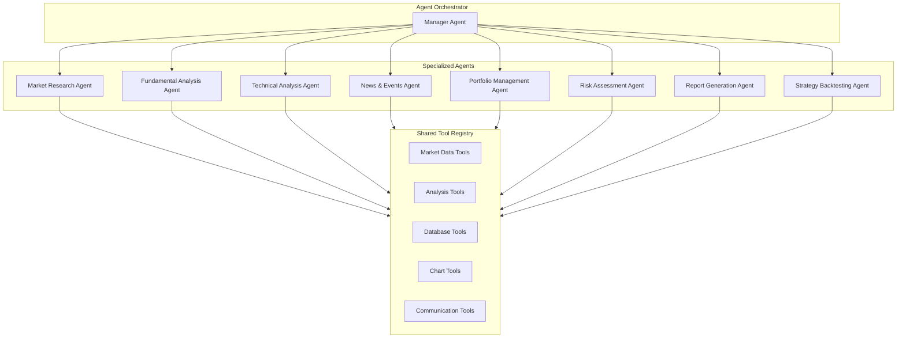

---

## 23. Appendices

### Appendix A: Complete AI Task-to-Model Mapping

| Module | Task | Local Model | Cloud Model | Fallback |
|:---|:---|:---|:---|:---|
| Dashboard | Morning Briefing | — | Gemini Flash | Claude Haiku |
| Dashboard | Market Regime | Qwen3-8B | — | DeepSeek Flash |
| Dashboard | Portfolio Health | — | Gemini Flash | DeepSeek Flash |
| Fundamentals | Per-Card Insight | Qwen3-8B | — | DeepSeek Flash |
| Fundamentals | Stock Narrative | Qwen3-14B | Gemini Flash | Claude Haiku |
| Fundamentals | Intrinsic Value | — | Claude Sonnet | Gemini Pro |
| Technical | Per-Indicator Insight | Qwen3-8B | — | DeepSeek Flash |
| Technical | Signal Generation | Qwen3-14B | Gemini Flash | Claude Haiku |
| Technical | Pattern Recognition | CNN (local) | GPT-4o Vision | Gemini Vision |
| Options | OI Interpretation | Qwen3-14B | Gemini Flash | DeepSeek Flash |
| Options | Strategy Suggestion | — | Claude Sonnet | Gemini Pro |
| Options | GEX Narrative | Qwen3-14B | Gemini Flash | Claude Haiku |
| Events | Classification | Qwen3-8B | Gemini Flash-Lite | — |
| Events | Impact Assessment | — | Gemini Flash | Claude Haiku |
| Events | Precedent Lookup | RAG + Qwen3-14B | RAG + Gemini Flash | — |
| Macro | Indicator Analysis | — | Gemini Flash | DeepSeek Flash |
| Macro | Cycle Assessment | — | Claude Sonnet | Gemini Pro |
| Journal | Trade Analysis | — | Gemini Flash | Claude Haiku |
| Journal | Behavioral Patterns | Qwen3-14B | — | Gemini Flash |
| Chat | General Conversation | — | Gemini Flash | Claude Haiku |
| Chat | Complex Research | — | Claude Sonnet | Gemini Pro |
| Chat | Chart QA | — | GPT-4o Vision | Gemini Vision |
| Drawing | Pattern Detection | CNN (local) | GPT-4o Vision | — |
| Scanner | NL Query Parsing | Qwen3-8B | Gemini Flash-Lite | — |
| Reports | Report Generation | — | Claude Sonnet | Gemini Pro |
| Alerts | Alert Context | Qwen3-8B | — | DeepSeek Flash |
| Strategy | Strategy Suggestion | — | Claude Sonnet | Gemini Pro |
| Embedding | All embeddings | nomic-embed-text | Gemini Embedding | OpenAI embed-3 |
| Reranking | All reranking | BGE-reranker-v2-m3 | Cohere Rerank | — |

### Appendix B: Latency Budget

| Module | Operation | Target P50 | Target P99 | Notes |
|:---|:---|:---|:---|:---|
| Dashboard | Page load (cached) | 500ms | 2s | All tiles from cache |
| Dashboard | Morning briefing (cold) | 3s | 8s | Cloud + RAG |
| Fundamentals | Card rendering (cached) | 100ms | 500ms | From SQLite cache |
| Fundamentals | Full AI refresh | 10s | 30s | Backend cron |
| Technical | Indicator update | 50ms | 200ms | Deterministic |
| Technical | Signal generation | 500ms | 2s | Local model |
| Technical | Pattern detection | 1s | 3s | CNN inference |
| Options | OI card update | 200ms | 1s | Cached + local |
| Options | Strategy suggestion | 2s | 8s | Cloud model |
| Events | Event classification | 1s | 3s | Cloud or local |
| Events | Impact assessment | 3s | 10s | Cloud + RAG |
| Chat | First token | 500ms | 2s | Streaming |
| Chat | Full response | 3s | 15s | Depends on complexity |
| Embedding | Single document | 50ms | 200ms | Local Ollama |
| Embedding | Batch (100 docs) | 2s | 5s | Parallel local |
| Vector search | Query | 10ms | 50ms | Qdrant HNSW |
| Reranking | Top-20 rerank | 50ms | 200ms | Local cross-encoder |

### Appendix C: Data Volume Estimates (Per Year)

| Data Type | Volume/Year (100 users) | Volume/Year (10K users) |
|:---|:---|:---|
| OHLCV Candles (1500 instruments, daily) | ~500 MB | ~500 MB (shared) |
| AI Card Scores | ~5 GB | ~5 GB (shared) |
| News Articles + Embeddings | ~2 GB | ~2 GB (shared) |
| Chat History | ~100 MB | ~10 GB |
| Journal Entries + Embeddings | ~50 MB | ~5 GB |
| User Profiles + Settings | ~10 MB | ~1 GB |
| Event Data + Embeddings | ~500 MB | ~500 MB (shared) |
| Total | **~8 GB** | **~25 GB** |

### Appendix D: Caching Architecture

```mermaid
graph TB
    subgraph CacheLayers["Cache Layers"]
        L1[L1: Frontend Memory Cache]
        L2[L2: Service Worker Cache]
        L3[L3: Redis Hot Cache]
        L4[L4: SQLite Warm Cache]
        L5[L5: MongoDB Cold Storage]
    end

    subgraph TTL["TTL Strategy"]
        T1["Real-time quotes: 0s (live)"]
        T2["AI card scores: 15min"]
        T3["Morning briefing: 4hr"]
        T4["Fundamental data: 12hr"]
        T5["Event classifications: Permanent"]
        T6["Semantic cache: 1hr"]
    end

    L1 --> L2 --> L3 --> L4 --> L5
```

| Cache Type | Technology | TTL | Size Limit | Eviction |
|:---|:---|:---|:---|:---|
| **Frontend Memory** | React state / Zustand | Session | 50 MB | Component unmount |
| **Service Worker** | Cache API | 1 hour | 100 MB | LRU |
| **Redis Hot** | Redis | 15 min - 4 hr | 1 GB | TTL-based |
| **Semantic Cache** | Redis + Embedding similarity | 1 hour | 500 MB | TTL + similarity threshold |
| **SQLite Warm** | SQLite WAL | 12 hr - 7 days | 5 GB | Cron cleanup |
| **DuckDB Archive** | DuckDB | Permanent | Unlimited | None |

### Appendix E: Technology Decision Matrix

| Decision | Option A | Option B | Option C | Selected | Rationale |
|:---|:---|:---|:---|:---|:---|
| LLM Runtime | Ollama | llama.cpp | vLLM | **Ollama** | Best DX, REST API, model management |
| Vector DB | Qdrant | ChromaDB | LanceDB | **Qdrant** | Performance + filtering + production-ready |
| AI Framework | LangGraph | CrewAI | Custom | **Custom + LiteLLM** | Avoid framework lock-in; LiteLLM for routing |
| Memory | Mem0 | Zep | Custom | **Mem0** | Framework-agnostic, simple API |
| Observability | Langfuse | LangSmith | Custom | **Langfuse** | Open-source, self-hosted, free |
| Embedding | nomic-embed | BGE-M3 | OpenAI | **nomic-embed** | Free, local, good quality |
| Reranker | BGE-reranker | Cohere | jina | **BGE-reranker** | Free, local, good quality |
| Cache | Redis | Dragonfly | KeyDB | **Redis Stack** | Industry standard, JSON + Search modules |
| Analytics DB | DuckDB | TimescaleDB | ClickHouse | **DuckDB** | Embedded, zero-config, excellent for OHLCV |
| Cloud LLM (Primary) | Gemini | Claude | GPT-4o | **Gemini Flash** | Best cost/performance, 1M context |
| Cloud LLM (Complex) | Claude Sonnet | Gemini Pro | GPT-4o | **Claude Sonnet** | Best reasoning quality |
| Guardrails | NeMo | LLM Guard | Custom | **NeMo Guardrails** | Most mature, configurable |

### Appendix F: Glossary

| Term | Definition |
|:---|:---|
| **MCP** | Model Context Protocol — standardized interface between AI apps and external tools/data |
| **RAG** | Retrieval-Augmented Generation — augmenting LLM context with retrieved documents |
| **VRAM** | Video Random Access Memory — GPU memory for model storage |
| **GGUF** | GPT-Generated Unified Format — quantized model file format |
| **LoRA** | Low-Rank Adaptation — efficient fine-tuning method |
| **GEX** | Gamma Exposure — aggregate gamma held by market makers |
| **PCR** | Put-Call Ratio — ratio of put OI to call OI |
| **IV** | Implied Volatility — market's expectation of future price volatility |
| **OI** | Open Interest — total outstanding derivative contracts |
| **OHLCV** | Open, High, Low, Close, Volume — standard price bar data |
| **HyDE** | Hypothetical Document Embeddings — RAG query transformation technique |
| **MTEB** | Massive Text Embedding Benchmark — standard for evaluating embeddings |
| **CoT** | Chain-of-Thought — prompting technique for step-by-step reasoning |
| **HITL** | Human-in-the-Loop — requiring human approval for AI actions |
| **TTL** | Time-to-Live — cache expiration duration |

---

## Document Revision History

| Version | Date | Author | Changes |
|:---|:---|:---|:---|
| 1.0 | 2026-07-15 | AI Architecture Division | Initial draft |
| 2.0 | 2026-07-20 | AI Architecture Division | Complete rewrite — all 20 modules, enterprise specifications |

---

> **CONFIDENTIAL** — This document contains proprietary architectural specifications for the Praxis Financial Intelligence Platform. Distribution is restricted to authorized engineering personnel only.

---

*End of Document*
